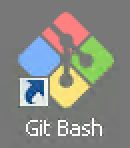

Navigation - [Previous Page](LTRDEV-1100-02b-Python-Ex2.md)

---

### Exercise 2: Setting up Python Virtual Environments

#### Objectives

The objectives for this exercise are to:

* Setup a Python virtual environment for this lab

Different projects using Python may have different environment requirements. For instance, one project may need a 
Python 2.x interpreter, whereas others may need Python 3.x. Some projects may require many Python packages and 
modules to be installed, and others may only use built-in modules.

Traditionally, installing a package for Python is a global change on a particular host. This means that if one project 
needs access to one version of a package, and another project needs to upgrade to a different version of the same 
package, it could break the first project. Thankfully, there is a tool that can help tackle this problem: Virtualenv.

Virtualenv allows isolating Python environments to specific directories, as opposed to globally. This means each 
virtual environment can run its own Python executable in the correct version, and install its own packages and modules. 
By creating separate virtual environments per project, a developer can manage these dependencies of each project 
without inadvertently causing harm to other projects.

#### Step 1: Setting up a Python Virtual Environment

Now that we know that Python v3.x is available for use, it is time to set up a virtual environment to continue working
in.

1.  Open the Git Bash terminal by double clicking the Git Bash icon on the desktop:
    
    
    
    

2. First, create and enter a directory called `pythonenv` as a home for your project.
    
    ```
    $ cd ~/lab
    $ mkdir pythonenv
    ```

3.  Next, create a Python virtual environment in this directory with the `python` command. By default, Python will 
build a virtual environment based on the same version of the Python interpreter invoked, Python 3.x in the case of 
the lab environment we've prepared for you.  If you need to create a virtual environment for a different version of 
Python, then invoke the version of the Python interpreter executable,  for example `py -2 -m venv python` or
`py -3 -m venv pythonenv` in Windows to create a Python 2.x or Python 3.x virtual environment, respectively.  To 
create a Python 3.x virtual environment for this lab, simply use the `python` command:

    ```
    $ python -m venv pythonenv
    
    $
    ```

4.  Now that the virtual environment is created, go ahead and activate it so that any packages installed for your 
project will stay within this specific environment. This is done by running the `activate` command in the virtual 
environment directory you created.  The path to the `activate` command will vary based on the platform you are working.  
For Windows, the `activate` command can be found in the `Scripts` directory, for example `pythonenv/Scripts/activate`.  
For macOS and Linux, the `activate` command can be found in the `bin` directory, for example `pythonenv/bin/activate`.
    
    For the purposes of this lab in the Windows lab environment we've prepared for you, activate the Python virtual 
    environment with the command `source pythonenv/Scripts/activate`:
    
    ```
    $ source pythonenv/Scripts/activate
    (pythonenv) $
    ```
    
    Now that the environment has been activated, notice that the prompt is now prepended with the virtual 
    environment project name in parentheses, `(pythonenv)` in the case of this lab. This means that any 
    Python packages that you install or remove in this terminal session will be specific to this project unless you 
    deactivate the virtual environment or exit the Git Bash terminal.
 
5. To deactivate the Python virtual environment, simply use the `deactivate` command (do not use the `source` command)
regardless of the platform you are running, for example:
    
    ```
    (pythonenv) $ deactivate
    $
    ```

    Congratulations, you now have a working Python virtual environment.  We will continue to work within this virtual
    environment for the rest of the lab when working with Python.

---

Navigation - [Next Page](LTRDEV-1100-Guide-02f.md)


