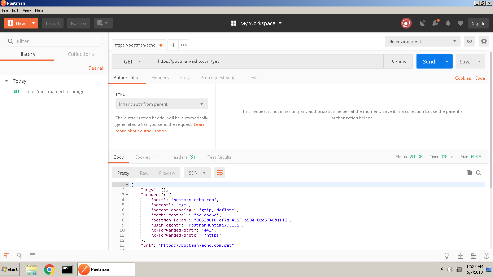

### Exercise 1: Getting Started with Postman

#### Objectives

The objectives for this exercise are to:

* Become familiar with the layout of Postman
* Understand how to make an API call
* Analyze the results of an API call

#### Step 1: Becoming Familiar with Postman Layout

Postman is organized in three main sections: the header bar, the side bar, and the build area. The header bar is 
located at the top and provides access to common administrative tasks: creating new requests, importing data, 
changing settings, and so forth. The side bar is on the left side and it contains a history of requests made, as well
as a section titled, "Collections," which we will look at in a later exercise. The build area is the majority of the
screen real estate in the Postman app, and it is where you can build and send API requests.

1. Locate the method dropdown at the top of the build area. This allows you to select the type of API request to 
make, such as an HTTP GET, PUT, POST, and so on. For our introductory lesson, please select `GET` as the method.

2. Next to the method dropdown, notice the field to input a URL. This is the web location for the API with which you 
want to interact. Immediately to the right of this URL is a button to add parameters to the URL. These are akin to 
appending the URL with key/value pairs via `?myvariable=1&another=2` syntax often noted at the end of web URLs.

3. Just below the URL field, there are a few more options to define the request. For instance, you can define headers
with the request. This is common with web requests in general. For instance, this is the method by which your mobile
phone's web browser can indicate that it is a mobile device, and hence you get the mobile version of a web page 
automatically. With APIs it is important as well; often times authentication keys, data formats, and more can be 
defined in headers.

4. The bottom half of the build area is where the response from the API requests is displayed. This will show the 
response code, the time to receive a response, and details of the response including any body and headers.

#### Step 2: Making an API call

1. In order to make an API call, we first have to select the HTTP method. 
    
    Three of the most common methods used in API calls are `GET`, `POST`, and `PUT`:
    
    * A `GET` request is used when getting information from an API. A `GET` request specifies the information in 
    which it is interested via the URL, parameters, and headers.
    * A `POST` request is one that is sending information to the API. This is often in the form of creating a new 
    data entry of some sort through the API.
    * A `PUT` request is often used to update existing information through the API.
    
    In our example, we will be making a `GET` request, so please make sure this is the method selected.

2. Now that we know we will be making a request for information, we need a location to find the API we are querying. 
Please specify the URL as `https://postman-echo.com/get` in the URL field. We do not require any parameters for this 
API.
    
    Click `Send` and watch for the response. If successful, the `Status` should return `200 OK` which means that the 
    request was accepted by the API.
    
    

#### Step 3: Analyzing the Results

1. After verifying the important response code is `200 OK` we can start to dig into the other components of the 
response. Notice the body of the response that is shown below. The response is a set of data displayed in the JSON 
format of key/value pairs.

2. Aside from the body of the response, there are also headers that give information about the response. For 
instance, the header `Content-Type` specifies `application/json` as its value. This data is important if working with
APIs programmatically, as JSON formatted data would be parsed differently than, say, XML formatted data.
    
    
