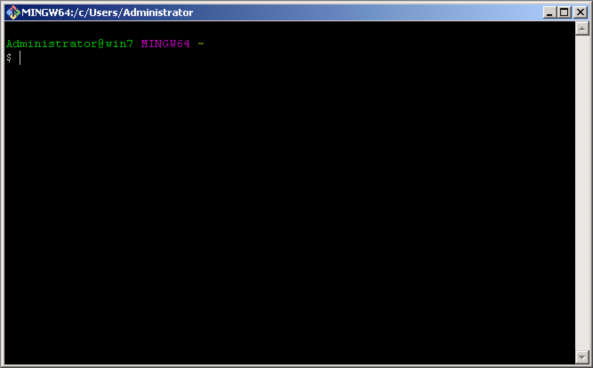
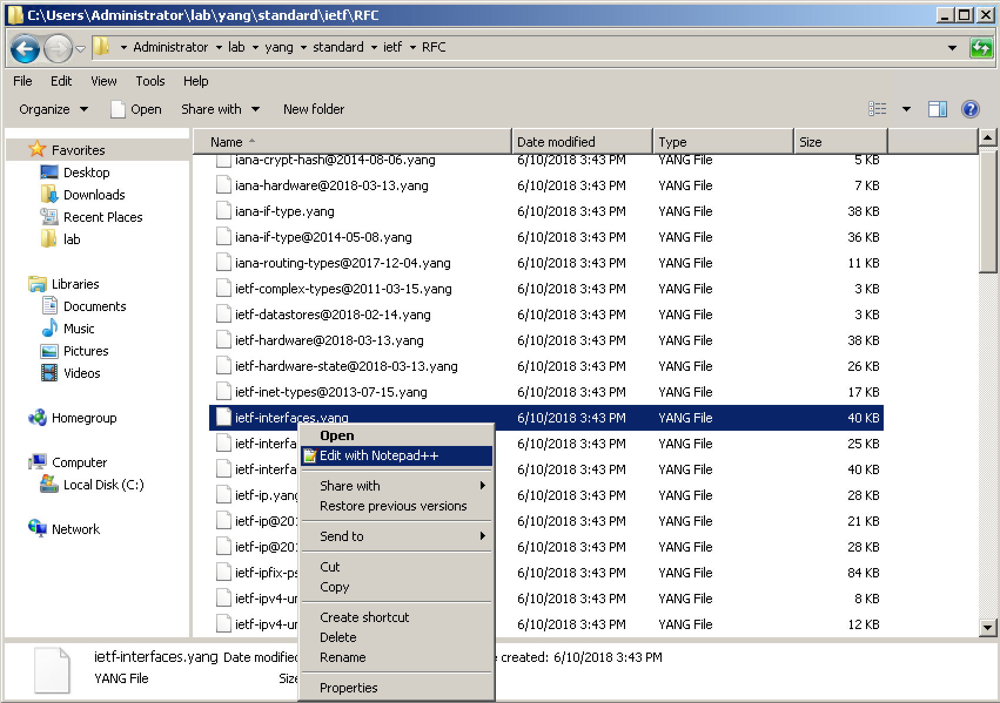
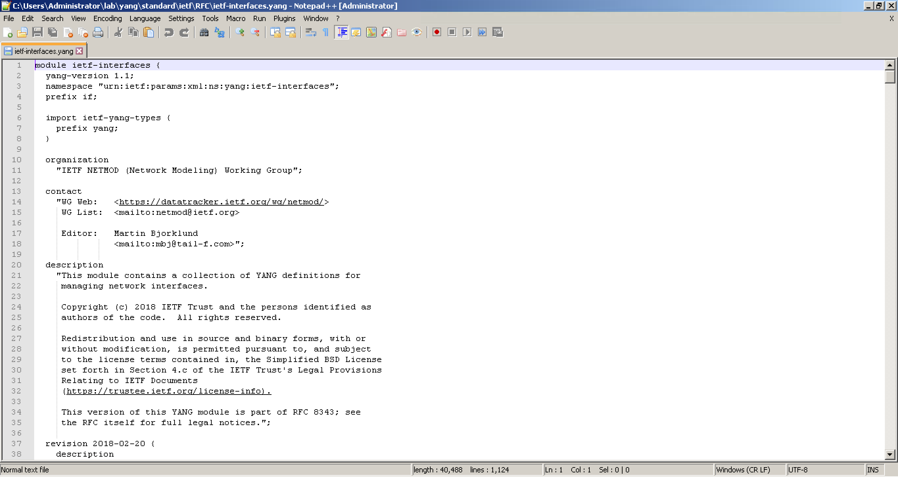

Navigation :: [Previous Page](LTRDEV-1100-03b1-NETCONF.md) :: [Table of Contents](LTRDEV-1100-00-Intro.md#table-of-contents) :: [Next Page](LTRDEV-1100-03b3-NETCONF-Ex2.md)

---

### Exercise 1: Introducing YANG

#### Objectives

The objectives for this exercise are to:

* Understand YANG as a language, YANG as a data model, and YANG data
* Explore the anatomy of a YANG data model
* Use pyang to explore data models

YANG (Yet Another Next Generation) was developed by the IETF NETMOD (Network Modeling) Working Group and published as
[RFC 6020](https://tools.ietf.org/html/rfc6020) in 2010.  YANG has become the de facto data modeling language.  But 
YANG is more than just a modeling language.  It is also the data models and the data itself.  When we talk about YANG, 
depending on the context, we mean YANG as a language, YANG as a data model, and YANG data.


#### Step 1: Understanding YANG as a Language

YANG is a modular and structured language that represents, or describes, data models in an XML tree format.  The YANG
modeling language is protocol independent and can be converted into any encoding format such as XML or JSON - more 
on that later in this lab.  You and I may speak English; YANG is the way that our programs can speak to our network 
devices without confusion or interpretation.  Here is a brief example of the YANG modeling language:

```
module ietf-interfaces {
    import ietf-yang-types {
        prefix yang;
    }
    container interfaces {
        list interface {
            key "name";
            leaf name {
            type string;
        }
        leaf enabled {
            type boolean;
            default "true";
    }
}
```

#### Step 2: Understanding YANG as a Model

A data model does nothing more than describe or represent data.  This is a way to agree how to describe something, 
for example a person:

* Person
    * Gender, e.g. male or female
    * Height, e.g. feet and inches or meters
    * Weight, e.g. pounds or kilograms
    * Eye Color, e.g. blue, green, brown, or hazel
    * Hair Color, e.g. blond, brown, or black
    
Even with a generic data model such as this simple example, we can describe a person in a manner that is easily 
understood.  Although YANG data models could be used to describe anything, they were developed to describe network 
devices and the services we build with those devices.

A YANG data model might describe a network device data or network service data.  Some examples of each include:

* Device Data Model
    * Interface
    * VLAN
    * EIGRP
    
* Service Data Model
    * L3 MPLS VPN
    * VRF
    * System Management
    
For the purposes of getting started with model driven programmability, it is easier to focus on device data models. 

YANG data models can be written by anyone, but the most frequently used models come from the IETF in the form of 
Internet standards, or other models come from [OpenConfig](http://www.openconfig.net/) in the form of community- and 
industry-developed vendor neutral models.  Vendors also write vendor- and product-specific data models for their 
products and services.

#### Step 3: Understanding YANG Data

Don't confuse the data model, the data format, and the data itself.  Consider the following three examples:

1. Text -
    
    ```
    switch# show int bri
    
    --------------------------------------------------------------------------------
    Ethernet      VLAN    Type Mode   Status  Reason                   Speed     Port
    Interface                                                                    Ch #
    --------------------------------------------------------------------------------
    Eth1/1        1       eth  fabric down    SFP not inserted            10G(D) --
    ```

 2. XML -
    
    ```
    <?xml version="1.0" encoding="ISO-8859-1"?>
    <nf:rpc-reply xmlns:nf="urn:ietf:params:xml:ns:netconf:base:1.0" xmlns="http://www.cisco.com/nxos:1.0:if_manager">
     <nf:data>
      <show>
       <interface>
        <__XML__INTF_ifeth_brf>
         <__XML__PARAM_value>
          <__XML__INTF_output>Ethernet1/1-3</__XML__INTF_output>
         </__XML__PARAM_value>
         <__XML__OPT_Cmd_show_interface_if_eth_brief___readonly__>
          <__readonly__>
           <TABLE_interface>
            <ROW_interface>
             <interface>Ethernet1/1</interface>
             <vlan>1</vlan>
             <type>eth</type>
             <portmode>fabric</portmode>
             <state>down</state>
             <state_rsn_desc>SFP not inserted</state_rsn_desc>
             <speed>10G</speed>
             <ratemode>D</ratemode>
            </ROW_interface>
           </TABLE_interface>
          </__readonly__>
         </__XML__OPT_Cmd_show_interface_if_eth_brief___readonly__>
        </__XML__INTF_ifeth_brf>
       </interface>
      </show>
     </nf:data>
    </nf:rpc-reply>
    ]]>]]>
    ```

3. JSON - 
    
    ```
    {
        "interfaces": [
            {
                "interface": "Ethernet1/1", 
                "vlan": "1", 
                "type": "eth", 
                "portmode": "fabric", 
                "state": "down", 
                "state_rsn_desc": "SFP not inserted", 
                "speed": "10G", 
                "ratemode": "D"
            }    
        ]
    }
    ```

Each of these examples represent the exact same data, displayed in three different common formats: human-readable text, 
XML, and JSON.  Because the YANG data is described as a YANG data model in a structured manner using the YANG 
language, we can programmatically display the data in any format that suits our need.  For the rest of this lab, YANG
data will be encoded in XML as specified in the NETCONF IETF Internet Standard discussed later in this lab.

#### Step 4: Exploring the Anatomy of a YANG Data Model

The YANG modeling language is used to build YANG data models using a standard syntax.  There are several important 
constructs used in YANG:

1. Every YANG data model contains a `module` which contains the name of the model, describes the data, and 
documents the revision history of the model itself.

2. YANG defines four types of nodes for data modeling:
    
    * A `leaf` node contains a single, simple value like an integer or string, for example:
        
        ```
        leaf host-name {
           type string;
           description "Hostname for this system";
       }
       ```
    
    * A `leaf-list` node is a sequence of one or more `leaf` nodes, for example:
        
        ```
        leaf-list domain-search {
         type string;
         description "List of domain names to search";
        }
        ```
    
    * A `list` node is a sequence of  entries identified by a key value of each key leaf.  A `list` node
    can contain `leaf`, `leaf-list`, `list`, or `container` nodes.  For example,
        
        ```
        list user {
            key "name";
            leaf name {
                type string;
            }
            leaf full-name {
                type string;
            }
            leaf class {
                type string;
            }
        }
        ```
    
    * A `container` node is a group of related nodes as child nodes and no value itself.  There is no
     limit to the number of child nodes within a `container` node.  A `container` node can include `leaf`, 
     `leaf-list`, `list`, or other `container` child nodes.  For example,
        
        ```
        container system {
            container login {
                leaf message {
                    type string;
                    description
                        "Message given at start of login session";
                }
            }
        }
        ```

#### Step 5: Using pyang to Explore YANG Data Models

Now that we have a basic understanding of a YANG data model, let's take a look at an actual model.  You can obtain 
the IETF and OpenConfig YANG data models from GitHub.

1.  Open the Git Bash terminal by double clicking the Git Bash icon on the desktop:
    
    
    
    

2.  Make sure that your terminal shows the prepended project name `(pythonenv)`. If it does not, then change to
your lab working directory and activate the Python virtual environment you created earlier in this lab:
    
    ```
    $ cd ~/lab
    $ source pythonenv/Scripts/activate
    (pythonenv) $
    ```

3. Clone the YANG GitHub repository from `https://github.com/YangModels/yang`:
    
    ```
    $ cd ~/lab
    $ git clone https://github.com/YangModels/yang
    Cloning into 'yang'...
    remote: Counting objects: 13445, done.
    remote: Compressing objects: 100% (187/187), done.
    remote: Total 13445 (delta 353), reused 529 (delta 353), pack-reused 12905
    Receiving objects: 100% (13445/13445), 23.11 MiB | 581.00 KiB/s, done.
    Resolving deltas: 100% (9076/9076), done.
    $
    ```

4. Let's take a look at one of the YANG models `ietf-interfaces.yang`.
    
    Open the lab folder by double clicking the Windows Explore shortcut on the lab workstation desktop:
    
    
    
    Navigate to `yang`, `standard`, `ietf`, then `RFC` directory:
    
    
    
    Right click the file `ietf-interfaces.yang` and click `Edit with Notepad++`.
    
    
    
    As you scroll through this file representing the `module ietf-interface` data model, you will find the 
    elements we discussed earlier in this lab.  You can see the structure and nodes.  Each node should be documented 
    with a description.  You can get a sense for what operational state and configuration details you this YANG data 
    model describes.
    
3. I think we can agree browsing a directory full of files written in the YANG modeling language can get tedious.  A 
data format that is good for programming is not necessarily good for human readability.  Fortunately, we have a tool
that can help you called [pyang](https://github.com/mbj4668/pyang) that is a quick `pip install` away.
    
    Make sure that your terminal shows the prepended project name `(pythonenv)`. If it does not, then change to
    your lab working directory and activate the Python virtual environment you created earlier in this lab:
    
    ```
    $ cd ~/lab
    $ source pythonenv/Scripts/activate
    (pythonenv) $
    ```
    
    Ensure that pyang is installed with the `pip install` command, for example:
    
    ```
    (pythonenv) $ pip install pyang==1.7.5
    Collecting pyang
        Using cached https://files.pythonhosted.org/packages/d5/5d/248a83662d8ea7f1594be022e1c7017f2fa83c7e5949e9500290302aae95/pyang-1.7.5-py2.py3-none-any.whl
    Requirement already satisfied: lxml in c:\users\administrator\lab\pythonenv\lib\site-packages (from pyang) (4.2.1)
    Installing collected packages: pyang
    Successfully installed pyang-1.7.5
    (pythonenv) $
    ```
    
    Now navigate to the directory that contains the `ietf-interfaces.yang` YANG data model file:
    
    ```
    (pythonenv) $ cd ~/lab/yang/standard/ietf/RFC
    ```
    
    Use pyang to display the data model in a human readable tree format with the `pyang` command:
    
    ```
    (pythonenv) $ pyang -f tree ietf-interfaces.yang
    module: ietf-interfaces
    +--rw interfaces
    |  +--rw interface* [name]
    |     +--rw name                        string
    |     +--rw description?                string
    |     +--rw type                        identityref
    |     +--rw enabled?                    boolean
    |     +--rw link-up-down-trap-enable?   enumeration {if-mib}?
    |     +--ro admin-status                enumeration {if-mib}?
    |     +--ro oper-status                 enumeration
    |     +--ro last-change?                yang:date-and-time
    |     +--ro if-index                    int32 {if-mib}?
    |     +--ro phys-address?               yang:phys-address
    |     +--ro higher-layer-if*            interface-ref
    |     +--ro lower-layer-if*             interface-ref
    |     +--ro speed?                      yang:gauge64
    |     +--ro statistics
    |        +--ro discontinuity-time    yang:date-and-time
    |        +--ro in-octets?            yang:counter64
    |        +--ro in-unicast-pkts?      yang:counter64
    |        +--ro in-broadcast-pkts?    yang:counter64
    |        +--ro in-multicast-pkts?    yang:counter64
    |        +--ro in-discards?          yang:counter32
    |        +--ro in-errors?            yang:counter32
    |        +--ro in-unknown-protos?    yang:counter32
    |        +--ro out-octets?           yang:counter64
    |        +--ro out-unicast-pkts?     yang:counter64
    |        +--ro out-broadcast-pkts?   yang:counter64
    |        +--ro out-multicast-pkts?   yang:counter64
    |        +--ro out-discards?         yang:counter32
    |        +--ro out-errors?           yang:counter32
    x--ro interfaces-state
         x--ro interface* [name]
            x--ro name               string
            x--ro type               identityref
            x--ro admin-status       enumeration {if-mib}?
            x--ro oper-status        enumeration
            x--ro last-change?       yang:date-and-time
            x--ro if-index           int32 {if-mib}?
            x--ro phys-address?      yang:phys-address
            x--ro higher-layer-if*   interface-state-ref
            x--ro lower-layer-if*    interface-state-ref
            x--ro speed?             yang:gauge64
            x--ro statistics
               x--ro discontinuity-time    yang:date-and-time
               x--ro in-octets?            yang:counter64
               x--ro in-unicast-pkts?      yang:counter64
               x--ro in-broadcast-pkts?    yang:counter64
               x--ro in-multicast-pkts?    yang:counter64
               x--ro in-discards?          yang:counter32
               x--ro in-errors?            yang:counter32
               x--ro in-unknown-protos?    yang:counter32
               x--ro out-octets?           yang:counter64
               x--ro out-unicast-pkts?     yang:counter64
               x--ro out-broadcast-pkts?   yang:counter64
               x--ro out-multicast-pkts?   yang:counter64
               x--ro out-discards?         yang:counter32
               x--ro out-errors?           yang:counter32
    (pythonenv) $
    ```
    
    The first thing you should notice is how much easier this is to read and understand.
    
    The line `module: ietf-interfaces` contains the module name.
    
    The line beginning `+--rw interfaces` is a container node, which contains a list node:
    
    The line beginning `|  +--rw interface* [name]` is a list node with the key `[name]`, which contains several leaf
    nodes.  For example, the line `+--rw description?                string` is a leaf node that describes a string
    value.  You can see the data model itself is very detailed and well structured but difficult to read if you're 
    looking for pertinent data for your application.  With the use of pyang, on the other hand, you are given just 
    the right amount of information needed to find the data you need for your application.
    
    The `ro` or `rw` next to the node name indicates whether the data is non-configuration data (`ro`) or 
    configuration data (`rw`).  A `?` after the node name indicates that the data is optional and may not be 
    present on the network device.  A `*` after the node name indicates that the node is a leaf or leaf-list.
    For more information about the symbols and conventions used by pyang in the tree format, use the command 
    `pyang --tree-help`.
    
    The second thing that you should notice is the lack of data. Remember, we are only viewing the YANG data 
    model, not YANG data from a network device. We will explore actual YANG data from an IOS XE device later in 
    this lab after we introduce NETCONF.

---

Navigation :: [Previous Page](LTRDEV-1100-03b1-NETCONF.md) :: [Table of Contents](LTRDEV-1100-00-Intro.md#table-of-contents) :: [Next Page](LTRDEV-1100-03b3-NETCONF-Ex2.md)
