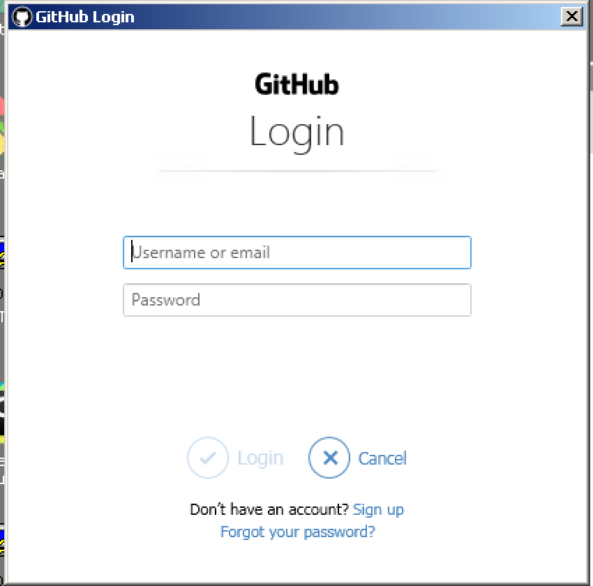
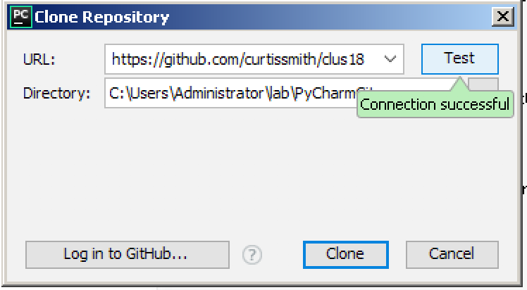
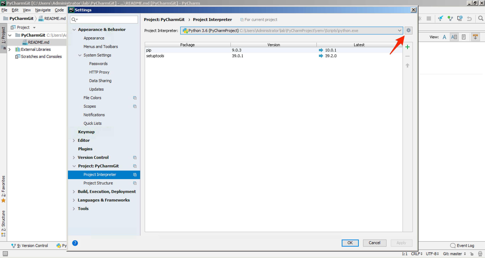
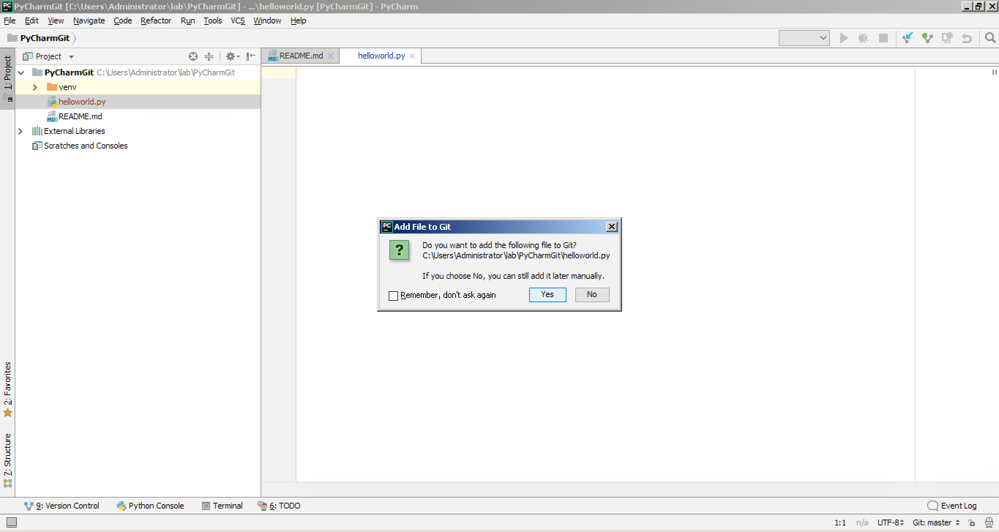
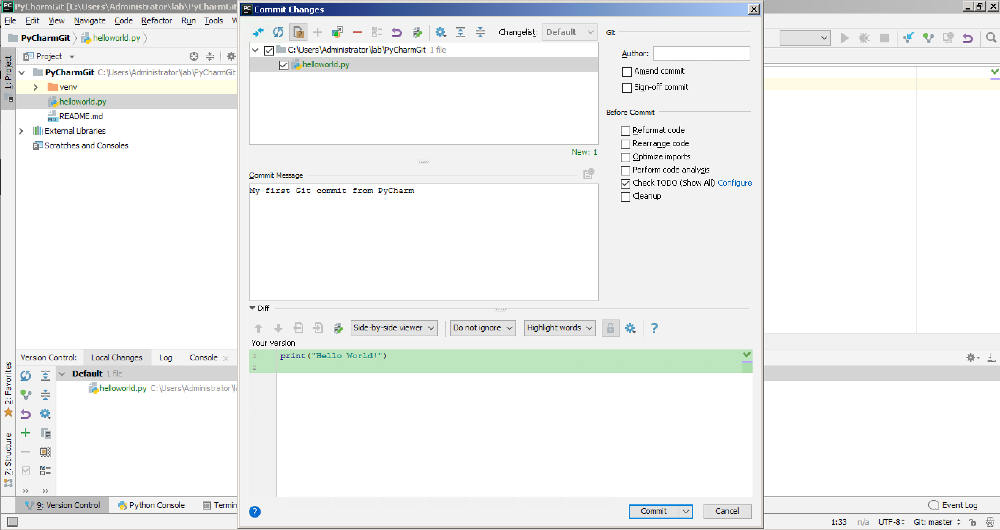

Navigation :: [Previous Page](LTRDEV-1100-05a2-PyCharm-Ex1.md) :: [Table of Contents](LTRDEV-1100-00-Intro.md#table-of-contents) :: [Next Page](LTRDEV-1100-05b1-Postman.md)

### Exercise 2: Getting Advanced with PyCharm

#### Objectives

The objectives for this exercise are to:

* Learn how to keep your project under version control in Git with PyCharm

#### Step 1: Managing a Project's Git Repository in PyCharm

Earlier in this lab, we created a new PyCharm project from scratch.  Now, let's explore creating a PyCharm project by
cloning a Git repository and keeping your project under revision control.

1.  Close the current PyCharm project by navigating to the `File` menu and clicking the `Close Project` menu 
item.

2. Click `Check out from Version Control` from the `Welcome to PyCharm` window and click `Git`.
    
    

4. In the `URL:` box, type the URL for your Git repository you created earlier in this lab.  For example, 
`https://github.com/curtissmith/clus18`, replacing `curtissmith` with your Git username.
    
    In the `Directory:` box, type the path to a PyCharm project directory that does not already exist, for example 
    `C:\Users\Administrator\lab\PyCharmGit`.
    
    
    
    Click the `Test` button to test the Git repository URL you've typed.  When prompted, enter your GitHub 
    credentials to login.
    
    
    
    If the test was successful, click the `Clone` button.
    
    
    
    Click the `Yes` button when prompted to open the directory.
    
    
    
5. Now you have a new PyCharm project cloned from your Git repository.  Double click to expand the `PyCharmGit` 
project directory in the PyCharm project view.
    
    You will find the `README.md` file we created earlier in the lab.  Double click the `README.md` file to open the 
    file in the PyCharm editor.
    
    When you double click to open the `README.md` file, you'll notice the editor will open and you have many of the 
    same editing features with a Markdown file as you do with a Python file.  There is an additional feature where 
    PyCharm will preview the Markdown file live for you.  Click the buttons in editor window to toggle to show the 
    editor only, show the editor and a preview, or show a preview only.
    
    
    
    Click the `No` button when prompted to add the file to Git.  We will take care of this later in the lab.

6. When you open the Markdown file `README.md`, PyCharm recognizes this file type and provides many of the syntax 
help and analysis as a Python file.  An additional split window is also available in the PyCharm editor that displays 
a preview of the Markdown!  You can toggle this split view by clicking the buttons below the navigation bar.
    
    

6.  You will notice there is no `venv` directory in your PyCharm project.  That is because PyCharm did not create one 
when it cloned the Git repository.  However, we can configure and create one easily.
    
    Click the `File` menu and click `Settings`.
    
    Double click `Project: PyCharmGit` to expand the tree and click `Project Interpreter`.
    
    Click the gear button next to the drop down box labeled `Project Interpreter:`.
    
    
    
    Click to select `Virtualenv Environment`.
    
    Click the radio button to select `New environment`.
    
    Accept the default `Location:`, for example `C:\Users\Administrator\lab\PyCharmGit\venv`.
    
    Click the drop down box labeled `Base interpreter:` to select a Python version 3 interpreter.
    
    Accept the remaining default options and click the `OK` button.
    
    
    
    A new Python virtual environment will be created for you.  In the drop down box labeled `Project Interpreter:`, 
    click to select `Python 3.6 (PyCharmGit)`.  Click the `OK` button.
    
    
    
7. Let's re-create our "Hello World!" Python code.  Right click on `helloworld` and select `New` and click `Python
File`.
    
    Navigate to the `File` menu and click `New...` menu item.
    
    Click `Python File` in the pop up window.
    
    
    
    In the box labeled `Name:`, type `helloworld.py`.  Click the drop down box labeled `Kind:` and select `Python 
    file`.
    
    
    
    Click the `OK` button.
    
    PyCharm knows that this project is under revision control with Git and prompts you to add the new 
    file to Git.  Click the `Yes` button.
        
    
    
    Now you have a new file named `helloworld.py` in the the root of your PyCharm `PyCharmGit` project directory.
    Go ahead and re-write Python code in the PyCharm editor:
    
    ```
    print("Hello World!")
    
    ```
    
    and save your changes by clicking the `File` menu and clicking `Save All`.
    
    

8. You will also notice new buttons in the navigation bar at the top of the application window and a new tool window bar
in the tool window tab at the bottom of the application window window: `Version Control`.  Click the `Version 
Control` tab.
    
    
    
    First, you will get a status of all local changes.  Double click `Default` and you see your Python file 
    `helloworld.py`.
    
    Second, you will see `Unversioned Files` - too numerous to list, so click the `browse` button.
    
    Double click to expand the tree and you notice you have two directories each with files that are 
    unversioned.  These include the PyCharm project `.idea` directory and Python virtual environment `venv` 
    directory.
    
    Click to select the `.idea` directory.
    
    Click the fourth button from the left `Ignore`.
    
    Click the radio button labeled `Ignore all files under`.
    
    
        
    Click the `OK` button.
    
    Click to select the `venv` directory.
    
    Click the fourth button from the left `Ignore`.
    
    Click the radio button labeled `Ignore all files under`.
    
    
    
    Click the `Close` button.
    
    Now it is time to commit your changes.  Navigate to the `VCS` menu and click the `Commit...` menu item.
    
    In the box labeled `Commit Message`, add an entry such as `My first Git commit from PyCharm`.
    
    
    
    Click the `Commit` button.
    
    Now push your commited changes to the remote GitHub repository.  Navigate to the `VCS` menu, `Git` submenu, and 
    click the `Push...` menu item.
    
    
    
    Click the `Push` button.
        
    PyCharm will show you the status of your Git push and tell you when the action has been completed successfully.
    
    
    
    Check your handiwork by opening a web browser and navigating to your Git repository in GitHub, for 
    example `https://github.com/curtissmith/clus18`, replacing `curtissmith` with your own GitHub username.
    
Congratulations, you've cloned a remote Git repository, staged a new Python file, committed those changes, and pushed
your changes into the remote Git repository without leaving the PyCharm application or having to go back and 
forth between PyCharm and the command line.  PyCharm makes managing the whole project easy, including with version 
control.Navigation :: [Previous Page](LTRDEV-1100-05a2-PyCharm-Ex1.md) :: [Table of Contents](LTRDEV-1100-00-Intro.md#table-of-contents) :: [Next Page](LTRDEV-1100-05a1-PyCharm.md)

Navigation :: [Previous Page](LTRDEV-1100-05a2-PyCharm-Ex1.md) :: [Table of Contents](LTRDEV-1100-00-Intro.md#table-of-contents) :: [Next Page](LTRDEV-1100-05b1-Postman.md)
