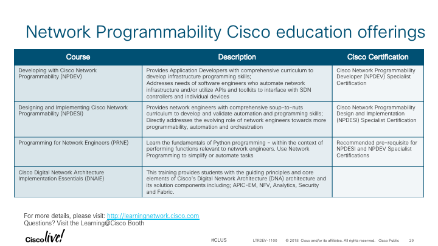

# Appendix 2

## Additional Network Programmability Resources

### Additional API Resources

1. Explore the developer information available at the [Cisco Meraki Dev site](https://create.meraki.io). This 
site contains reference documentation, code samples, and tutorials related to Cisco Meraki products. These APIs 
allow you to programmatically utilize the Meraki wireless access points, network switches, security appliances, and 
more.
    
    Click on the [Build](https://create.meraki.io/build/) menu along the top of the page. Which example sounds 
    interesting to you? Spend a few minutes checking out the different examples. Pull up one in particular, using
    [Meraki API with Google Forms](https://create.meraki.io/build/google-forms-with-the-dashboard-api/). As you read 
    through this, think about what goal is being accomplished? What other ways could the API with a form like this be 
    leveraged? Maybe a firewall rule change request?
    
    From the top menu, select [Learn](https://create.meraki.io/learn/) to list different tutorials available. We do not 
    have the time to dive into any of these right now, but these types of learning exercises can help bolster your 
    understanding of the Meraki API.

2. Explore the [Postman API Docs](https://create.meraki.io/postman) for a full reference of the available API
functions. For instance, click on `Devices` and then `List the devices in a network` to see the details of this 
particular GET call. Click to expand the example response in the right-side column. Which of these fields may be 
interesting if you were building an inventory script?

3. Many Cisco products have consolidated API information at the [Cisco DevNet](https://developer.cisco.com/) site. 
This web portal contains a plethora of reference documentation, tutorials, learning labs, sandbox environments, etc. 
This is a great place to start for learning more about the topics discussed in this lab.

### Cisco Learning Network

The [Cisco Learning Network](https://learningnetwork.cisco.com/welcome) has several resources for the
[Cisco Network Programmability Specialists certifications](https://learningnetwork.cisco.com/community/certifications/network-programmability):
[Network Programmability Developer](https://learningnetwork.cisco.com/community/certifications/network-programmability/network-application-developer)
and
[Network Programmability Design and Implementation Specialist](https://learningnetwork.cisco.com/community/certifications/network-programmability/design-and-implementation).

