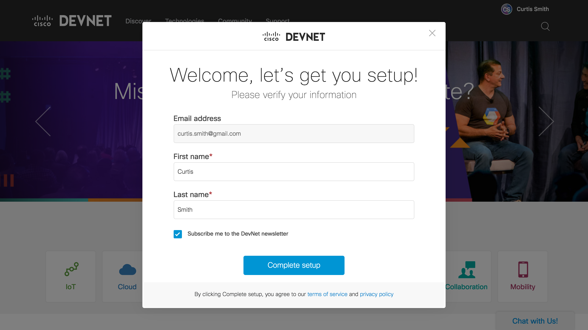
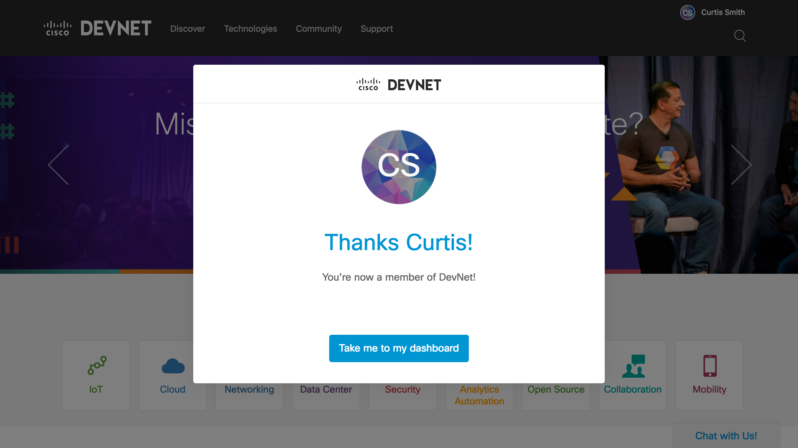
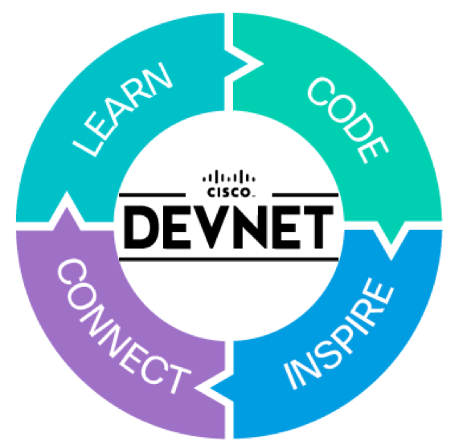

# The Network Programmability Dojo

TODO: 

- [x] @curtissmith Draft "The Network Programmability Dojo"

## What is Network Programmability

Even the most storied Ninja had to receive the training necessary to practice the methods and live the life to be 
succesful.  Thank you for taking the first step with this lab at Cisco Live!

### Defining Network Programmability

Think about your own environment.  How do you manage your networks and systems?  What are the most common methods or 
tools for deploying and managing your production environment?  Text editors; tens, hundreds, maybe 
thousands of documents, drawings, and spreadsheets; CLI commands; copy-and-paste; free or commercial applications?  
In recent years, there has been an incredible increase in the number of devices on your networks; number of 
applications stressing your networks; rate of change in consumer devices and applications; and pressure on network 
architects, engineers, and administrators or operators to support these demands and changes.  We tend to struggle 
with keeping up with demand and making human errors.

So-called DevOps (a compound of "Development" and "Operations") has become a popular practice of unifying development
and operations into a continuous flow of automation and monitoring throughout the stages of development, 
implementation, testing and validation, and deployment and management.  The goal is to decrease the time to cycle 
through each phase, allow for more frequent deployment, improve the quality of each deployment, and keep closely 
aligned with business priorities.  DevOps was first adopted in application and system development and deployment, and
now those teams are turning to the network team looking for integration with the underlying network for performance 
and segmentation.

The "Cloud" isn't just a destination; it is becoming an approach to delivering IT services efficiently and 
effectively.  You should start focusing on delivering solutions rather than individual devices and feature 
configuration.  Products must adapt to facilitate automation and efficient integration rather purely on "nerd knobs".

Perhaps network programmability is as much an ambiguous and overused term as Software Defined Networking.  At one 
time network programmability was synomous with OpenFlow.  Rather than getting wrapped up in semantics, let's agree 
network programmability is about driving real benefits, saving time and cost, and reducing human errors.  Network 
programmability is a set of tools and best practices to deploy, manage, and troubleshoot network devices.

Vendors, including Cisco, recognizes this, and the industry is delivering solutions based on application programming 
interfaces (APIs), software development kits (SDKs), and - this is particularly true of Cisco - resources, sample 
code, training, and a community to help customers learn and put into practice new skills to apply network
programmability tools and concepts to your networks.

## Getting Started with Network Programmability

TODO:

- [x] @curtissmith Add screen shots

How do you get started?  Well, this very lab is a great first step!  After completing this lab, we expect you to be 
armed with the Ninja training necessary to go and practice the fine art of network programmability in your job.

### Exercise 1: Joining Cisco DevNet

#### Objectives

The objectives for this exercise are to:

* Create a DevNet account
* Explore DevNet

#### Step 1: Creating a Cisco DevNet Account

The first step is joining [Cisco DevNet](https://developer.cisco.com/).  DevNet is your Network Programmability Dojo.
DevNet is where you can Learn, Code, Inspire, and Connect.  We'll explore what that means in the next step, but 
first, let's create a DevNet account.

1. Let's create your DevNet account.
    1. Navigate to [DevNet](https://developer.cisco.com): `https://developer.cisco.com/`.
        
        
        
    2. Click the `Login` link at the top right of the web page.
        
        
        
        You are given the choice of several single sign-on options.  We recommend using your Cisco ID, but you may 
        choose whichever you feel is appropriate.
    
    3. Once you've logged in, complete your DevNet account profile if this is your first time logging in and click 
    the `Complete setup` button.
        
        
        
    4. Congratulations, you've successfully joined Cisco DevNet!  Click the `Take me to my dashboard` button and you 
    are ready to explore DevNet.
        
        

#### Step 2: Exploring Cisco DevNet

DevNet is where you can Learn, Code, Inspire, and Connect.  It is the place to create and find inspiring applications,
learn about Cisco APIs, and connect with other developers in Cisco communities.  DevNet is the single resource for 
everything "developer" at Cisco.  DevNet answers these questions:

* What is it and do I want to use it?
* How do I get started?
* How do I get access?
* How do I use it?
* How do I get help?
* How do I share inspiration?

##### Learn

Access pre-release content; carry out coding tutorials and learning labs; and get paid case-based support and free 
online forum support.

Here are a few DevNet learning resources:

* DevNet [Learning Labs](https://learninglabs.cisco.com/) - A guided learning platform for Cisco technology.
* DevNet [Video Course](https://developer.cisco.com/video/net-prog-basics/) - Jumpstart your journey into network 
programmability with expert-led videos.

##### Code

Download API client libraries, reference guides, sample apps and sample code; access cloud-based development 
platforms; Warm up on API use with pre-configured demos; and test your code in the Sandbox Labs.

Here are a few DevNet code resources:

* DevNet [Sandbox](https://developer.cisco.com/site/sandbox/) - Free, 24x7 access to Cisco technology labs that 
allow you to dig in without having to purchase or build your lab environment.
* DevNet [Sample Code](http://ciscodevnet.github.io/#/sample-code) - Free access to sample code and projects, hosted 
on GitHub (we'll learn more about Git and GitHub later in the lab).
* DevNet [Application Developer Resources](https://developer.cisco.com/appdev/) - Discover the new kinds of 
applications that can be built when combined with the world's leading networking, collaboration, and IoT company.

##### Inspire

Share what you're building; submit your creations and be recognized for your efforts; and meet one-on-one at DevNet 
events.

Here are a few DevNet inspiration resources:

* DevNet [Creations](https://creations.devnetcloud.com/) - A platform of ideas, innovations, and inspiration.
* DevNet [Express Events](https://developer.cisco.com/site/devnet/events-contests/events/) - Join Cisco and your 
peers at DevNet Express events.  It is a focused event where you listen, learn, and put what you learn into practice.

##### Connect

Join communities of interest and participatein on-going discussions around technologies; participate in trending 
forums on variousCisco technologies; get your questions answered; meet and greet at events around the world.

Here are a few DevNet connect resources:

* DevNet [Communities of Interest](https://developer.cisco.com/site/coi/) - A place designed around your interests 
and needs, a place to visit regularly to interact, learn and connect with other community members and DevNet staff.
* DevNet [Express Events](https://developer.cisco.com/site/devnet/events-contests/events/) - Join Cisco and your 
peers at DevNet Express events.  It is a focused event where you listen, learn, and put what you learn into practice.
* DevNet [Zone](https://www.ciscolive.com/us/activities/world-of-solutions/devnet-zone/) - Join the fun and get 
hands-on with APIs available for your favorite Cisco products!  Our learning labs, classes, demos, mini-hacks, 
workshops, panels and more showcase how easily you can become a developer.