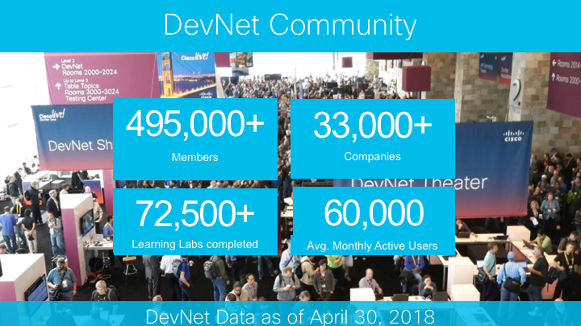
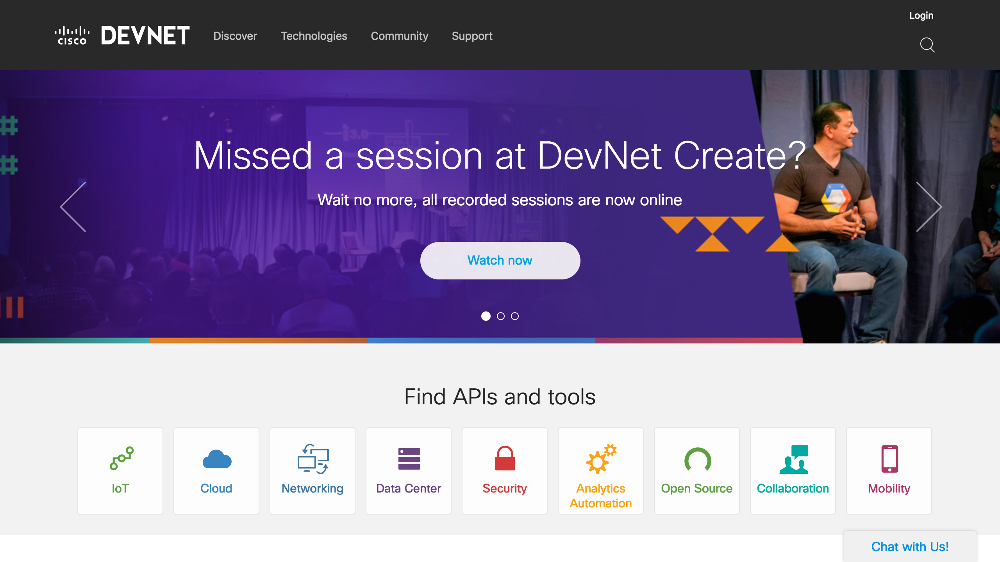
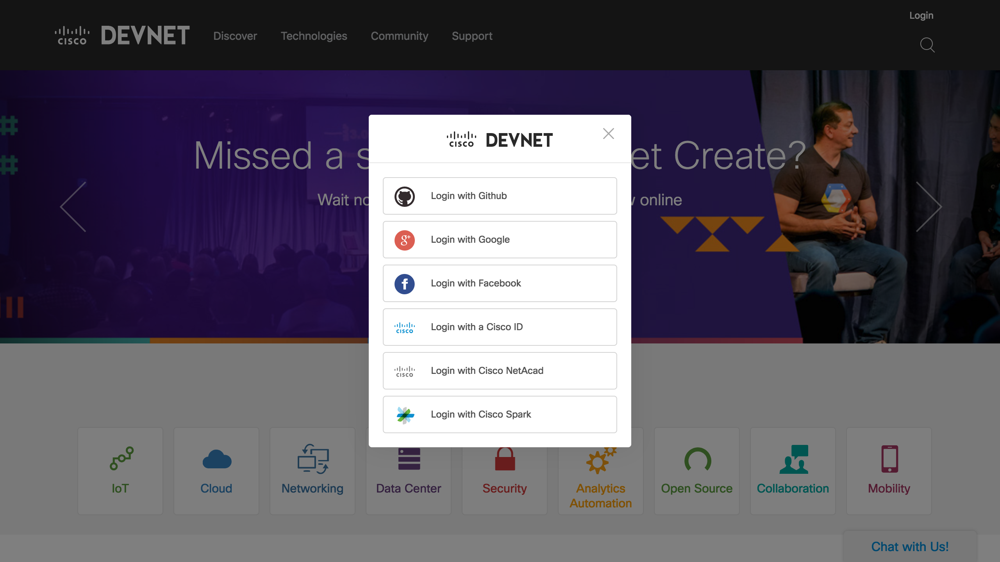

Navigation - [Previous Page](LTRDEV-1100-Guide-01.md)

---

## Cisco DevNet

### Introducing Cisco DevNet

DevNet is your Network Programmability Dojo.  DevNet is where you can Learn, Code, Inspire, and Connect.  It is the 
place to create and find inspiring applications, learn about Cisco APIs, and connect with other developers in Cisco 
communities.  DevNet is the single largest resource for everything "developer" at Cisco.

DevNet answers these questions:

* What is it and do I want to use it?
* How do I get started?
* How do I get access?
* How do I use it?
* How do I get help?
* How do I share inspiration?

#### Learn

Access pre-release content; carry out coding tutorials and learning labs; and get paid case-based support and free 
online forum support.

#### Code

Download API client libraries, reference guides, sample apps and sample code; access cloud-based development 
platforms; warm up on API use with pre-configured demos; and test your code in the Sandbox Labs.

#### Inspire

Share what you're building; submit your creations and be recognized for your efforts; and meet one-on-one at DevNet 
events.

#### Connect

Join communities of interest and participate in on-going discussions around technologies; participate in trending 
forums on various Cisco technologies; get your questions answered; meet and greet at events around the world.

### Exercise 1: Joining Cisco DevNet

#### Objectives

The objectives for this exercise are to:

* Create a DevNet account

#### Step 1: Creating a Cisco DevNet Account

The first step is your network programmability training is joining [Cisco DevNet](https://developer.cisco.com/).  Let's 
create your DevNet account, if you don't already have one.

1. Navigate to [DevNet](https://developer.cisco.com): `https://developer.cisco.com/`.
    
    

2. Click the `Login` link at the top right of the web page.
    
    
    
    You are given the choice of several single sign-on options.  We recommend using your Cisco ID, but you may 
    choose whichever you feel is appropriate.

3. Once you've logged in, complete your DevNet account profile if this is your first time logging in and click 
the `Complete setup` button.
    
    
    
4. Congratulations, you've successfully joined Cisco DevNet!  Click the `Take me to my dashboard` button and you 
are ready to explore DevNet.
        
    

### Exercise 2: Exploring Cisco DevNet

#### Objectives

The objectives for this exercise are to:

* Explore DevNet

#### Step 1: Exploring DevNet Learn Resources

Here are a few DevNet learning resources:

* DevNet [Learning Labs](https://learninglabs.cisco.com/) - A guided learning platform for Cisco technology.
* DevNet [Video Course](https://developer.cisco.com/video/net-prog-basics/) - Jumpstart your journey into network 
programmability with expert-led videos.

#### Step 2: Exploring DevNet Code Resources

Here are a few DevNet code resources:

* DevNet [Sandbox](https://developer.cisco.com/site/sandbox/) - Free, 24x7 access to Cisco technology labs that 
allow you to dig in without having to purchase or build your lab environment.
* DevNet [Sample Code](http://ciscodevnet.github.io/#/sample-code) - Free access to sample code and projects, hosted 
on GitHub (we'll learn more about Git and GitHub later in the lab).
* DevNet [Application Developer Resources](https://developer.cisco.com/appdev/) - Discover the new kinds of 
applications that can be built when combined with the world's leading networking, collaboration, and IoT company.

#### Step 2: Exploring DevNet Inspire Resources

Here are a few DevNet inspiration resources:

* DevNet [Creations](https://creations.devnetcloud.com/) - A platform of ideas, innovations, and inspiration.
* DevNet [Express Events](https://developer.cisco.com/site/devnet/events-contests/events/) - Join Cisco and your 
peers at DevNet Express events.  It is a focused event where you listen, learn, and put what you learn into practice.

#### Step 2: Exploring DevNet Connect Resources

Here are a few DevNet connect resources:

* DevNet [Communities of Interest](https://developer.cisco.com/site/coi/) - A place designed around your interests 
and needs, a place to visit regularly to interact, learn and connect with other community members and DevNet staff.
* DevNet [Express Events](https://developer.cisco.com/site/devnet/events-contests/events/) - Join Cisco and your 
peers at DevNet Express events.  It is a focused event where you listen, learn, and put what you learn into practice.
* DevNet [Zone](https://www.ciscolive.com/us/activities/world-of-solutions/devnet-zone/) - Join the fun and get 
hands-on with APIs available for your favorite Cisco products!  Our learning labs, classes, demos, mini-hacks, 
workshops, panels and more showcase how easily you can become a developer.

---

Navigation - [Next Page](LTRDEV-1100-Guide-02.md)
