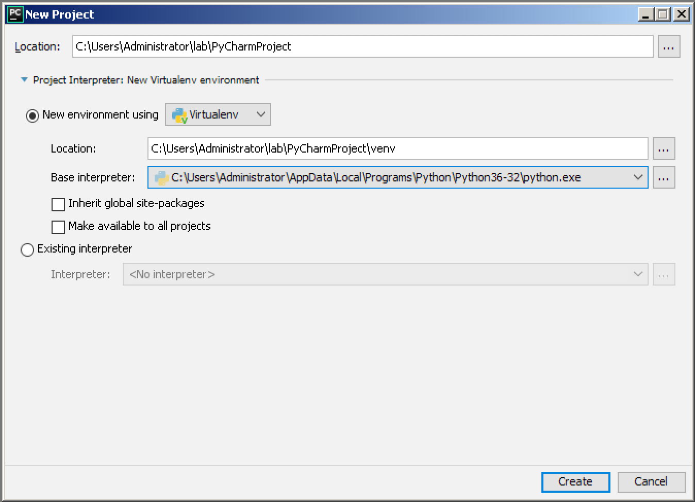
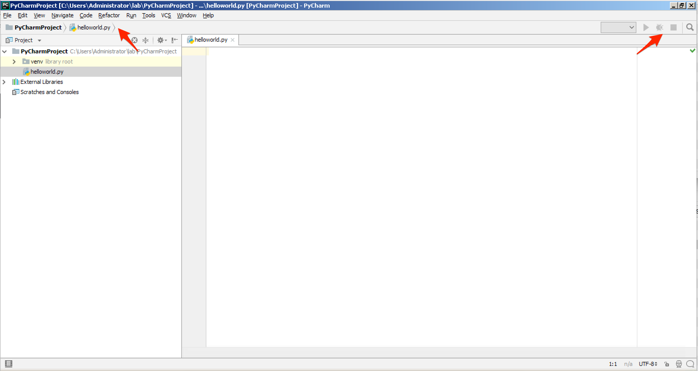
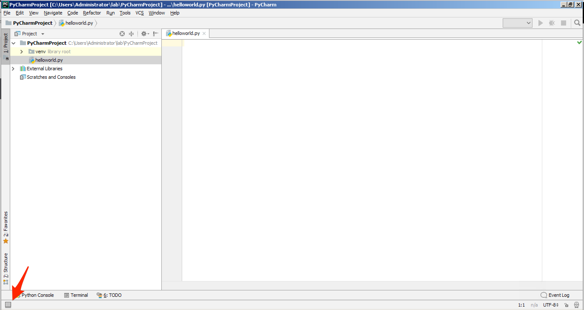
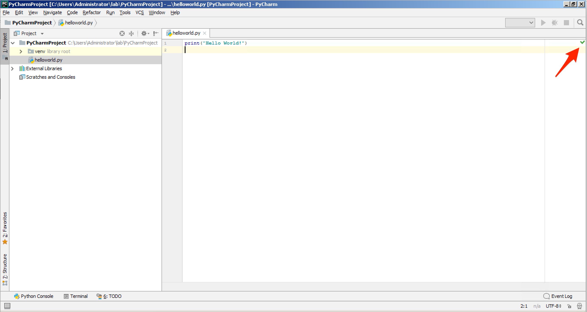
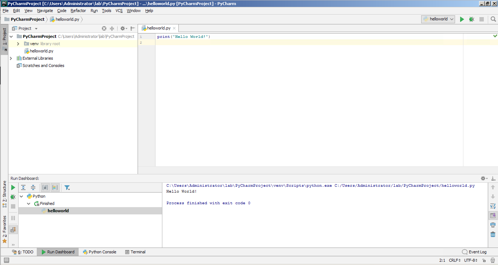
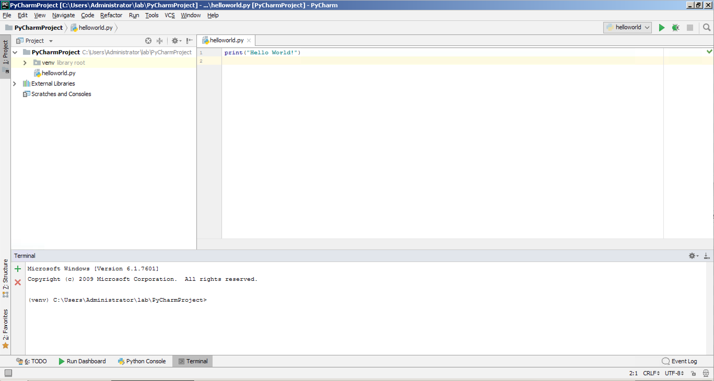
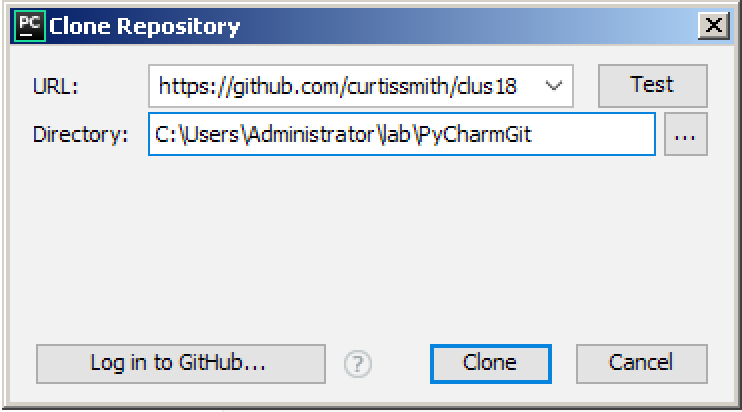
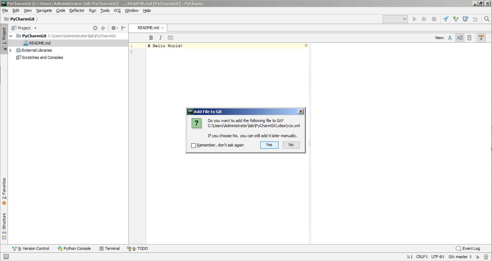

### Introducing PyCharm

TODO:

- [x] @curtissmith Draft "Tools of the Ninja - Other...PyCharm"
- [x] Proofread
- [x] Add screenshots

[PyCharm](https://www.jetbrains.com/pycharm/) is a Python integrated development environment (IDE) developed by 
[JetBrains](https://www.jetbrains.com/).  There is a [free community version](https://www.jetbrains.com/pycharm/download)
available for download, but you can support the application and obtain addtional features with the purchase of the 
[professional version](https://www.jetbrains.com/pycharm/buy/).  JetBrains describes PyCharm as 
an "intelligent coding assistant".
 
Key features of PyCharm include, but are not limited to:
 
* A smart code editor with syntax formatting, highlighting, completion and error detection
* Built-in terminal and integrated debugger
* Integrated support for version control systems, including Git
* Integrated support for Vagrant
 
An IDE like PyCharm is much more than a text editor, although it is that, too.  Let's take a look at what is key to 
getting started with PyCharm. 

### Exercise 1: Getting Started with PyCharm

#### Objectives

The objectives for this exercise are to:

* How to create a project in PyCharm
* Learn to navigate the PyCharm application GUI
* Write Python code with PyCharm
* Run and debug Python code with PyCharm

#### Step 1: Creating a New Project with PyCharm

When you run PyCharm for the first time, you are presented with the welcome screen and prompted to create a new 
project, open an existing project, or check out a project from version control.  First, let's create a new project.

1. Click `Create New Project`.
    
    
    
2. Choose a location for your new project, for example `PyCharmProjects/helloworld`.
    
    
    
    Click to expand `Project Interpreter: New Virtualenv environment`.
    
    Click the radio button to select `New environment using` and click the drop down menu to select `Virtualenv`.
    
    Accept the default `Location`, for example `PyCharmProjects/helloworld/venv`.
    
    Click the drop down box to select a Python version 3 interpreter.
    
    Accept the remaining default optoins and click the `Create` button.
    
Congratulations, you now have a new PyCharm project complete with a Python version 3 virtual environment ready to
write some code.  So far, we haven't touched the command line or had to manually create any directories for 
Python virtual environment by hand.  PyCharm performed the heavy lifting for us.  Next, let's take a look at the 
PyCharm GUI.

#### Step 2: Navigating PyCharm

When a project is opened, you see the PyCharm window divided into different tool bars, window areas, and a 
status bar.


1. The project view is on the left side of the main window.  This lists your project files.

2. The editor is on the right side of the main window.  This is where you write your code.  The editor has tabs so 
that you can open and navigate between multiple files at one time.
    
    The editor has a left and right column surrounding it.  In the left column, you will see line numbers which 
    lets you navigate the code more easily.  In the right column, you will see the result of PyCharm code inspection.
    
3. The navigation bar is above the project view and editor.  Within the navigation bar, there are buttons for quick 
access to run and debug your code and version control actions.

4. At the bottom of the main window is the tool windows.  These windows can be toggled to be displayed or not.  This 
is where your code will run if invoked from within PyCharm, you can manage project TODOs, access the Python 
interpreter console, and access a command line terminal.  These tool windows are designed to give you access to most 
everything you might need without having to leave PyCharm and open multiple windows or applications.

5. The status bar is at the bottom of the main window and displays project and application status and informational 
messages.

#### Step 3: Writing Code with PyCharm

In PyCharm, with your `helloworld` project open, double click the project in the project view to expand the tree.  
You will the Python virtual environment we discussed earlier in this lab.  This was automatically created for you by 
PyCharm when you created this project.  Let's create a new file and write some Python code.

1. Right click on `helloworld` and select `New` and click `Python File`.
    
    
    
2. Type `helloworld.py` in the `Name:` box and select `Python file` from the `Kind:` drop down box.  Click the `OK` 
button.
    
    
    
3. Now you have a new file names `helloworld.py` in your the root of your PyCharm `helloworld` project directory.  Go
ahead and start writing a bit of Python code in the PyCharm editor:
    
    ```
    print
    ```
    
    Did you notice that when you typed the word `print`, PyCharm popped up a tool tip with suggested Python syntax 
    and its usage?
    
    
    
    Continue by typing more:
    
    ```
    print("")
    ```
    
    PyCharm automatically closed the `()` and `""""` when you typed the opening `(` and '"'.  Additional tool tips 
    showed you more contextual Python syntax help.
    
    
    
    Continue by typing more:
    
    ```
    print("Hello World!")
    
    ```
    
    Now you have you first line of Python code written in PyCharm.  In the right column of the editor there 
    is a green checkmark.  Hover over the checkmark and PyCharm will pop up a tool tip indicating that its code 
    analysis is complete and no errors were found.
    
    
    
    Let's add a mistake intentionally to illustrate how this helps you write error-free code.  Type the following:
    
    ```
    print("Hello World!")
    
    asdfg
    
    ```

    PyCharm will display a warning symbol.  Hover over the warning symbol:
    
    
    
    PyCharm will include an indicator with the analysis of the error at the exact point in the code the error occurs.
      Hover over the red line:
    
    
    
    This is part of the wonder and charm (no pun intended) of PyCharm!
    
    Go ahead and remove the error, which should leave you with the following code:
    
    ```
    print("Hello World!")
    
    ```
    
    Save your changes by clicking the `File` menu and clicking `Save All`.

#### Step 4: Running Python Code with PyCharm

So far, you've seen how you can create a project, add a Python file, write Python code, and correct Python syntax 
errors with ease with PyCharm.  All without leaving PyCharm.  Now you will learn how to run and debug a Python 
application with PyCharm.

1.  With a project active and a Python file open in the editor, you can run the Python code from within 
PyCharm using the Python interpreter and virtual environment setup with the PyCharm project.  To run your `helloworld
.py` Python code, click on the green play button in the navigation bar on the top right side of the PyCharm 
application window:
    
    
    
    When you run a Python code in PyCharm, the main window will split and open the tool window on the bottom. 
    This will invoke the Python interpreter and run the Python code in the interpreter for you.  This is the 
    same as opening a terminal, creating and initializing the Python virtual environment with `virtualenv`, and 
    running the Python interpreter by hand as we did earlier in this lab.  Here is an example:
    
    
    
    You can leave the tools window open or close the window by clicking the `Run` tab at the bottom of the window.  
    You can bring the tools window back by clicking the `Run` tab again.
    
    You might have noticed there are other tabs in the tools window.  Let's explore those as well and see how they 
    are useful.
    
2.  Click the `Python Console` tab.   This should look familiar as it is the Python interpreter we used earlier in 
this lab.  This gives you place to test code snippets or interact with the Python interpretor directly why writing 
your Python code.  For example, type the simple "Hello World!" code in the Python Console:
    
    
    
3.  Click the `Terminal` tab.  This will open a command line interface terminal invoked from within the Python 
virtual environment created with this PyCharm project.  This would be the same thing as opening a terminal, changing 
to the project directory, and running `virtualenv` manually.  From here, you can run Python code directly, 
manipulate the file system directory and files, and run utilities from the command line.  Give it a try, perform a 
directory listing with the `dir` or `ls` command, based on whether you are on a Windows or macOS/Linux workstation:
    
    

### Exercise 2: Getting Advanced with PyCharm

#### Objectives

The objectives for this exercise are to:

* Learn how to keep your project under version control in Git with PyCharm

#### Step 1: Managing a Project's Git Repository in PyCharm

Earlier in this lab, we created a new PyCharm project from scratch.  Now, let's explore creating a PyCharm project by
cloning from a Git repository and how to keep our project under revision control.

1.  First, close the current PyCharm project by clicking on the `File` menu and clicking `Close Project`.

2.  You need to move the original PyCharm project since the name of the project matches the name of the Git 
repository we created earlier in this lab.  From the terminal:
    
    ```
    $ cd ~/PyCharmProjects
    $ mv helloworld helloworld.old
    $
    ```

3. Next, click `Check out from Version Control` from the `Welcome to PyCharm` window and click `Git`.
    
    

4. In the `URL:` box, type the URL for your Git repository you created earlier in this lab.  For example, 
`https://github.com/curtissmith/helloworld`, replacing `curtissmith` with your Git username.    
    
    Click the `Test` button to test the Git repository URL you've typed.
    
    
    
    If the test was successful, click the `Clone` button.
    
    Click the `Yes` button when prompted to open the directory.
    
    
    
5. Now you have a new PyCharm project cloned from your Git repository.  Double click to expand the `helloworld` 
project directory in the PyCharm project view.  You will find the `README.md` file we created earlier in the lab.

    When you double click to open the `README.md` file, you'll notice the editor will open and you have many of the 
    same editing features with a Markdown file as you do with a Python file.  There is an additional feature where 
    PyCharm will preview the Markdown file live for you.  Click the buttons in editor window to toggle to show the 
    editor only, show the editor and a preview, or show a preview only.
    
    
    
6.  You will notice there is no `venv` directory in your project.  That is because PyCharm did not create one when it
cloned the Git repository.  However, we can configure and create one easily.
    
    Click the `File` menu and click `Settings`.
    
    Double click `Project: helloworld` to expand the tree and click `Project Interpreter`.  You will notice that 
    this is empty or has an error.
    
    Click the gear button next to the drop downbox labeled `Project Interpreter` and click `Add...`.
    
    Click to select `Virtual Environment`.
    
    Click the radio button to select `New environment`
    
    Accept the default `Location`, for example `PyCharmProjects/helloworld/venv`.
    
    Click the drop down box to select a Python version 3 interpreter.
    Accept the remaining default options and click the `OK` button.
    
    
    
    A new Python virtual environment will be created for you.  Click the `OK` button.
    
7. Let's re-create our "Hello World!" Python code.  Right click on `helloworld` and select `New` and click `Python
File`.
    
    
    
    Type `helloworld.py` in the `Name:` box and select `Python file` from the `Kind:` drop down box.  Click the 
    `OK` button.
    
    
    
    This time, PyCharm knows that this project is under revision control with Git and prompts you to add the new 
    file to Git:
        
    For now, ignore the PyCharm project `.idea` directory and all its file contents.  Click the checkbox next to 
    `.idea` to unselect the directory and all files under that directory.  Ensure that `helloworld.py` is checked.
        
    
    
    Now you have a new file names `helloworld.py` in your the root of your PyCharm `helloworld` project directory.
    Go ahead and re-write Python code in the PyCharm editor:
    
    ```
    print("Hello World!")
    
    ```
    
    and save your changes by clicking the `File` menu and clicking `Save All`.

8. You will also notice new buttons in the naviation bar at the top of the PyCharm window and a new tool window in the 
tool window tab at the bottom of the PyCharm window: `Version Control`.  Click the `Version Control` tab.
    
    
    
    First, you will get a status of all local changes.  Double click `Default` and you see your Python file 
    `helloworld.py`.
    
    Second, you will see `Unversioned Files` - too numerous to list, so click the `browse` button.
    
    
    
    Double click to expand the tree and you notice you have two directories each with files that are 
    unversioned.  These include the PyCharm project `.idea` directory and Python virtual environment `venv` 
    directory.
    
    Click to select the `.idea` directory.
    
    Click the fourth button from the left `Ignore`.
    
    Click the radio buton labeled `Ignore all files under`.
    
    
        
    Click the `OK` button.
    Repeat the previous step to ignore the `venv` directory.
    
    Click the `Close` button.
    
    Now it is time to commit your changes.  Click the `VCS` menu and click `Commit...`
    
    Add an entry such as `Initial commit` in the `Commit Message` box.
    
    Click the `Commit` button.
    
    
    
    If PyCharm doesn't know your Git username, then it will prompt your for it.
    Fill out your name in the boxed labeled `Name` and email address in the boxed labeled `E-mail`.  
    Ensure that the checkbox labeled `Set properties globally` is checked.
    
    
    
    Click the `Set and Commit` button.
    
    Once all your changes are committed, don't forget to push your committed changed to the remote repository.
    
    Click the `VCS` menu, click `Git`, and click `Push`.
    
    
    
    Click the `Push` button.
        
    PyCharm will show you the status of your Git push and tell you when the action has been completed successfully.
    
    
    
    Check your handiwork by opening a web browser and navigating to your Git repository in GitHub, for 
    example `https://github.com/curtissmith/helloworld`, replacing `curtissmith` with your own GitHub username.
    
Congratulations, you've cloned a remote Git repository, staged a new Python file, committed those changes, and pushed
your changes into the remote Git repository - All without leaving the PyCharm application or having to go back and 
forth between PyCharm and the command line.  PyCharm makes managing the whole project easy, including with version 
control.
