Navigation - [Previous Page](LTRDEV-1100-Guide-02d.md)

---

### Introducing PyCharm

TODO:

- [x] @curtissmith Draft "Tools of the Ninja - Other...PyCharm"
- [x] Proofread
- [x] Add screenshots

[PyCharm](https://www.jetbrains.com/pycharm/) is a Python integrated development environment (IDE) developed by 
[JetBrains](https://www.jetbrains.com/).  There is a
[free community version](https://www.jetbrains.com/pycharm/download) available for download, but you can support the 
application and obtain addtional features with the purchase of the 
[professional version](https://www.jetbrains.com/pycharm/buy/).  JetBrains describes PyCharm as 
an "intelligent coding assistant".
 
Key features of PyCharm include, but are not limited to:
 
* A smart code editor with syntax formatting, highlighting, completion and error detection
* Built-in terminal and integrated debugger
* Integrated support for version control systems, including Git
* Integrated support for Vagrant
 
An IDE like PyCharm is much more than a text editor, although it is that, too.  Let's take a look at what is key to 
getting started with PyCharm. 

### Exercise 1: Getting Started with PyCharm

#### Objectives

The objectives for this exercise are to:

* How to create a project in PyCharm
* Learn to navigate the PyCharm application GUI
* Write Python code with PyCharm
* Run and debug Python code with PyCharm

#### Step 1: Creating a New Project with PyCharm

When you run PyCharm for the first time, you are presented with the welcome screen and prompted to create a new 
project, open an existing project, or check out a project from version control.  First, let's create a new project.

1. Double click the `PyCharm Community Edition` icon on the Desktop.
    
    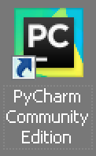

2. Click `Create New Project`.
    
    
    
2. Choose a location for your new project, for example `C:\Users\Adminstrator\lab\PyCharmProject`.
    
    Click to expand `Project Interpreter: New Virtualenv environment`.
    
    Click the radio button labeled `New environment using` and click the drop down menu to select `Virtualenv`.
    
    Accept the default `Location:`, for example `C:\Users\Adminstrator\lab\PyCharmProject\venv`.
    
    Click the drop down box labeled `Base interpreter:` to select the Python version 3 interpreter, for example 
    `C:\Users\Administrator\AppData\Local\Programs\Python\Python36-32\python.exe`.
    
    Accept the remaining default options and click the `Create` button.
    
    

    
Congratulations, you now have a new PyCharm project complete with a Python version 3 virtual environment ready to
write some code.  So far, we haven't touched the command line or had to manually create any directories for 
the Python virtual environment by hand.  PyCharm performed the heavy lifting for us.  Next, let's take a look at the 
PyCharm GUI.

#### Step 2: Navigating PyCharm

When a project is opened, you see the PyCharm window divided into different tool bars, window areas, a status bar, 
and Tip of the Day window.

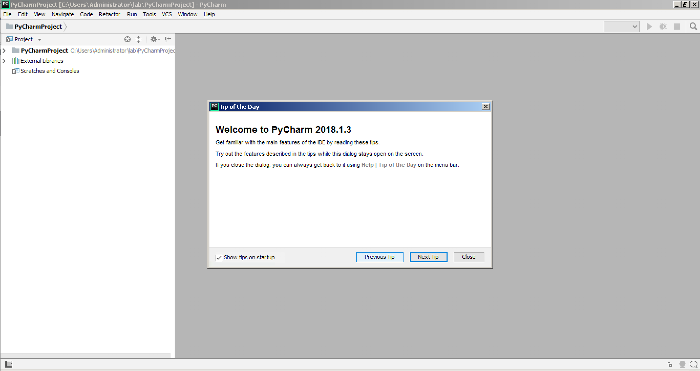

Click the `Close` button on the `Tips of the Day` window to close tips window.

1. The project view is on the left side of the main window.  This lists your project files.  Double click to expand 
`PyCharmProject` and you will see the Python virtual environment PyCharm created for this project in the `venv` 
directory.
    
    

2. The editor is on the right side of the main window.  This is where you write your code and edit files.  Let's create
a new file so that we can explore the editor in more detail.
    
    Navigate to the `File` menu and click `New...` menu item.
    
    Click `Python File` in the pop up window.
    
    
    
    In the box labeled `Name:`, type `helloworld.py`.  Click the drop down box labeled `Kind:` and select `Python 
    file`.
    
    
    
    Click the `OK` button.
    
    The editor has tabs so that you can open and navigate between multiple files at one time.
    
    The editor has a left and right column surrounding it.  In the left column, you will see line numbers as you 
    type in the file you are editing, allowing you to navigate code more easily.  In the right column, you will see the
    result of PyCharm code inspection, which we will explore later in this lab.
    
    
    
3. The navigation bar is above the project view and editor.  Within the navigation bar, there are buttons for quick 
access to run and debug your code and version control actions.
    
    

4. At the bottom left corner of the main application window is a button to toggle showing/hiding the tool window bars.  
These windows can be toggled to be displayed or not.  This is where your code will run if invoked from within PyCharm,
you can manage project TODOs, access the Python interpreter console, and access a command line terminal.  These tool 
windows are designed to give you access tasks and tools you might need to manage your project without having to leave 
PyCharm and open multiple windows or applications.
    
    Click the icon to show the tool window bars.  We will explore the tool window bars later in this lab.
    
    

5. The status bar is at the bottom of the main application window and displays project and application status and 
informational messages.

#### Step 3: Writing Code with PyCharm

Let's write some Python code with PyCharm.
    
1. You created a new Python file named `helloworld.py` in the root of your PyCharm `PyCharmProject` project 
directory.  Go ahead and start writing a bit of Python code in the PyCharm editor:
    
    ```
    print
    ```
    
    Did you notice that when you typed the word `print`, PyCharm popped up a tool tip with suggested Python syntax 
    and its usage?
    
    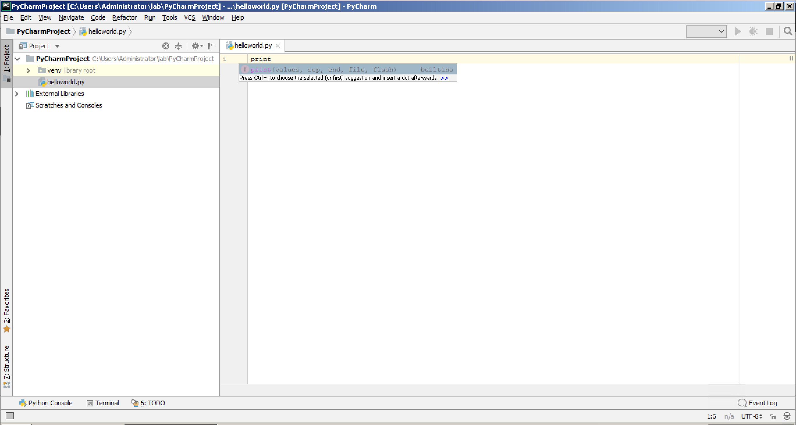
    
    Continue by typing more:
    
    ```
    print("")
    ```
    
    PyCharm automatically closed the `()` and `""` when you typed the opening `(` and `"`.  Additional tool tips 
    showed you more contextual Python syntax help.
    
    
    
    Continue by typing more (type the `Enter`/`Return` key at the end of the first line to create an empty second line):
    
    ```
    print("Hello World!")
    
    ```
    
    Now you have your first line of Python code written in PyCharm.  In the right column of the editor there 
    is a green check mark.
    
    
    
    Hover over the check mark and PyCharm will pop up a tool tip indicating that its code analysis is complete and no
    errors were found.
    
    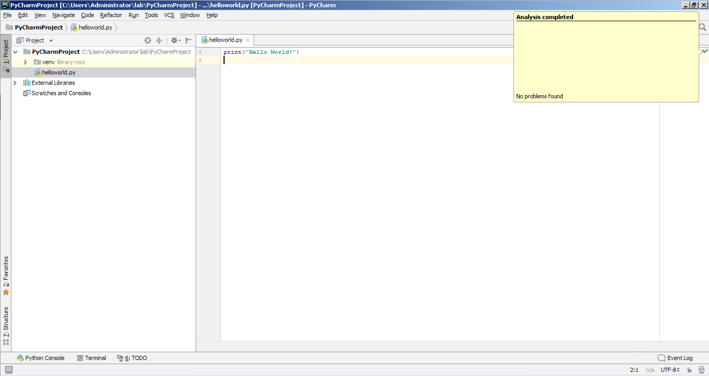
    
    Let's add a mistake intentionally to illustrate how this helps you write error-free code.  Type some gibberish on
    line 2:
    
    ```
    print("Hello World!")
    
    asdfg
    
    ```

    PyCharm will display a warning symbol.  Hover over the warning symbol:
    
    
    
    PyCharm will include an indicator with the analysis of the error at the exact point in the code the error occurs.
    Hover over the red line indicator on line 2 to see the result of the code analysis:
    
    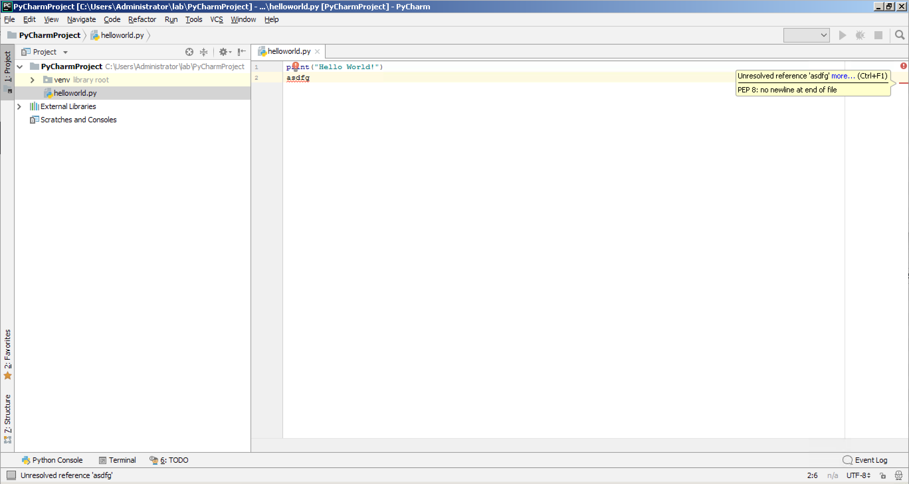
    
    This is part of the wonder and charm (no pun intended) of PyCharm!
    
    Go ahead and remove the error, which should leave you with the following code:
    
    ```
    print("Hello World!")
    
    ```
    
    Save your changes by navigating to the `File` menu and clicking `Save All` menu item.

#### Step 4: Running Python Code with PyCharm

So far, you've seen how you can create a project, add a Python file, write Python code, and correct Python syntax 
errors with ease with without leaving PyCharm.  Now you will learn how to run Python code with PyCharm.

1.  With your `PyCharmProject` project open and the Python file `helloworld.py` open in the editor, you can run the 
Python code from within PyCharm using the Python interpreter and virtual environment setup with the PyCharm project.
    
    Navigate to the `Run` menu and click the `Run...` menu item.
    
    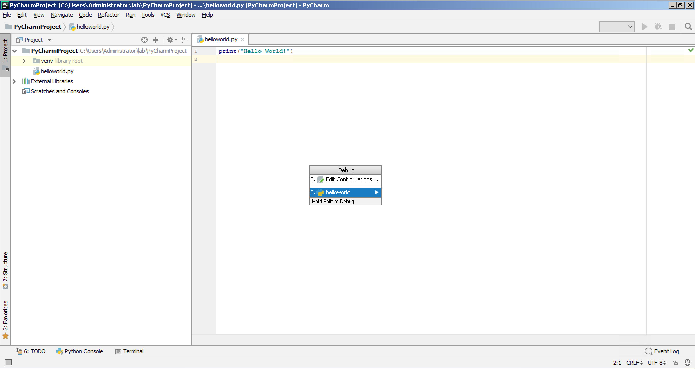
    
    Click on `2. helloworld`.
    
    When you run Python code in PyCharm, the main window will split and open the tool window bar on the bottom of the
    application window.  This will invoke the Python interpreter and run the Python code in the interpreter for you.  
    This is the same as opening a terminal, creating and initializing the Python virtual environment, and 
    running the Python interpreter by hand as we did earlier in this lab.  Here is an example:
    
    
    
    You can leave the tools window open or close the window by clicking the `Run Dashboard` tab at the bottom of the 
    tool window bar.  You can bring the tools window back by clicking the `Run Dashboard` tab again.
    
    You might have noticed there are other tabs in the tools window.  Let's explore those as well and see how they 
    are useful.
    
2.  Click the `Python Console` tab at the bottom of the tool window bar.  If you get a Windows Security Alert message 
window, click the `Allow Access` button.
    
    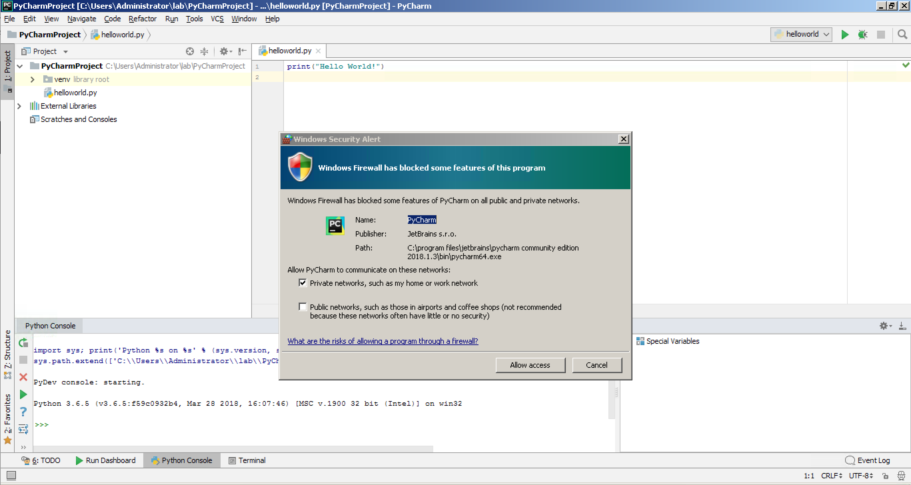
    
    This should look familiar as it is the Python interpreter we used earlier in this lab.  This gives you place to 
    test code snippets or interact with the Python interpreter directly while writing your Python code.
    
    For example, type the simple "Hello World!" code in the Python Console:
    
    
    
3.  Click the `Terminal` tab at the bottom of the tool window bar.  This will open a command line interface terminal 
invoked from within the Python virtual environment created with this PyCharm project.  This would be the same thing 
as opening a terminal, changing to the project directory, and running the Python virtual environment manually.
    
    
    
    From here, you can run Python code directly, manipulate the file system directory and files, and run utilities 
    from the command line.
    
    For example, perform a directory listing with the `dir` command:
    
    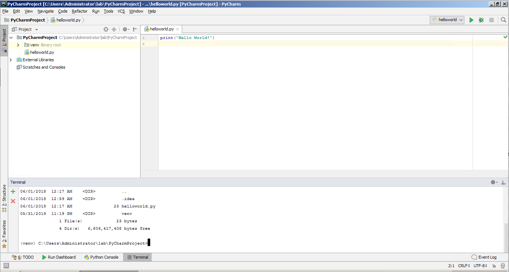

### Exercise 2: Getting Advanced with PyCharm

#### Objectives

The objectives for this exercise are to:

* Learn how to keep your project under version control in Git with PyCharm

#### Step 1: Managing a Project's Git Repository in PyCharm

Earlier in this lab, we created a new PyCharm project from scratch.  Now, let's explore creating a PyCharm project by
cloning a Git repository and keeping your project under revision control.

1.  Close the current PyCharm project by navigating to the `File` menu and clicking the `Close Project` menu 
item.

2. Click `Check out from Version Control` from the `Welcome to PyCharm` window and click `Git`.
    
    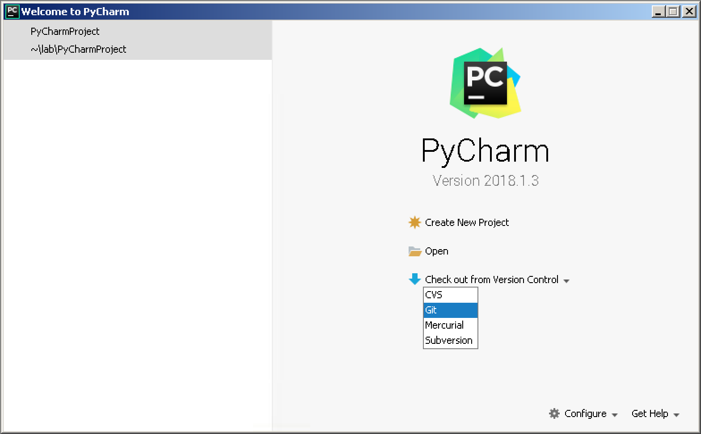

4. In the `URL:` box, type the URL for your Git repository you created earlier in this lab.  For example, 
`https://github.com/curtissmith/clus18`, replacing `curtissmith` with your Git username.
    
    In the `Directory:` box, type the path to a PyCharm project directory that does not already exist, for example 
    `C:\Users\Administrator\lab\PyCharmGit`.
    
    
    
    Click the `Test` button to test the Git repository URL you've typed.  When prompted, enter your GitHub 
    credentials to login.
    
    
    
    If the test was successful, click the `Clone` button.
    
    
    
    Click the `Yes` button when prompted to open the directory.
    
    
    
5. Now you have a new PyCharm project cloned from your Git repository.  Double click to expand the `PyCharmGit` 
project directory in the PyCharm project view.
    
    You will find the `README.md` file we created earlier in the lab.  Double click the `README.md` file to open the 
    file in the PyCharm editor.
    
    When you double click to open the `README.md` file, you'll notice the editor will open and you have many of the 
    same editing features with a Markdown file as you do with a Python file.  There is an additional feature where 
    PyCharm will preview the Markdown file live for you.  Click the buttons in editor window to toggle to show the 
    editor only, show the editor and a preview, or show a preview only.
    
    
    
    Click the `No` button when prompted to add the file to Git.  We will take care of this later in the lab.

6. When you open the Markdown file `README.md`, PyCharm recognizes this file type and provides many of the syntax 
help and analysis as a Python file.  An additional split window is also available in the PyCharm editor that displays 
a preview of the Markdown!  You can toggle this split view by clicking the buttons below the navigation bar.
    
    

6.  You will notice there is no `venv` directory in your PyCharm project.  That is because PyCharm did not create one 
when it cloned the Git repository.  However, we can configure and create one easily.
    
    Click the `File` menu and click `Settings`.
    
    Double click `Project: PyCharmGit` to expand the tree and click `Project Interpreter`.
    
    Click the gear button next to the drop down box labeled `Project Interpreter:`.
    
    
    
    Click to select `Virtualenv Environment`.
    
    Click the radio button to select `New environment`.
    
    Accept the default `Location:`, for example `C:\Users\Administrator\lab\PyCharmGit\venv`.
    
    Click the drop down box labeled `Base interpreter:` to select a Python version 3 interpreter.
    
    Accept the remaining default options and click the `OK` button.
    
    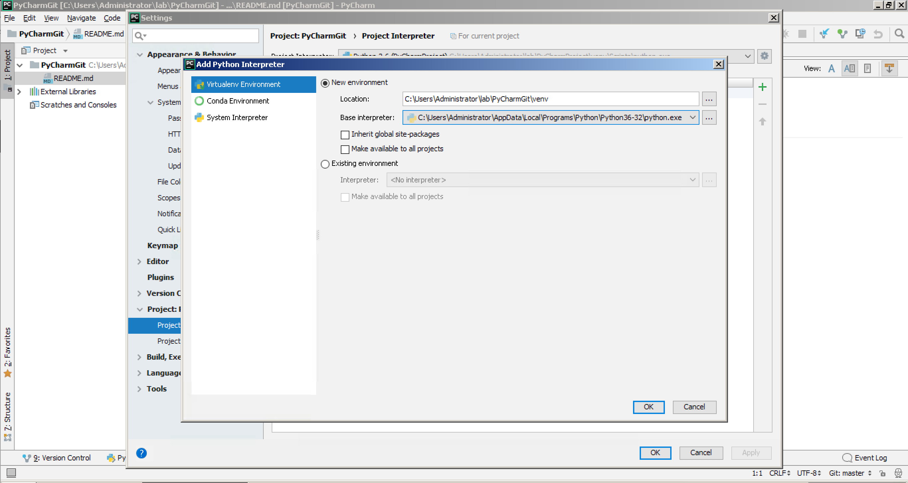
    
    A new Python virtual environment will be created for you.  In the drop down box labeled `Project Interpreter:`, 
    click to select `Python 3.6 (PyCharmGit)`.  Click the `OK` button.
    
    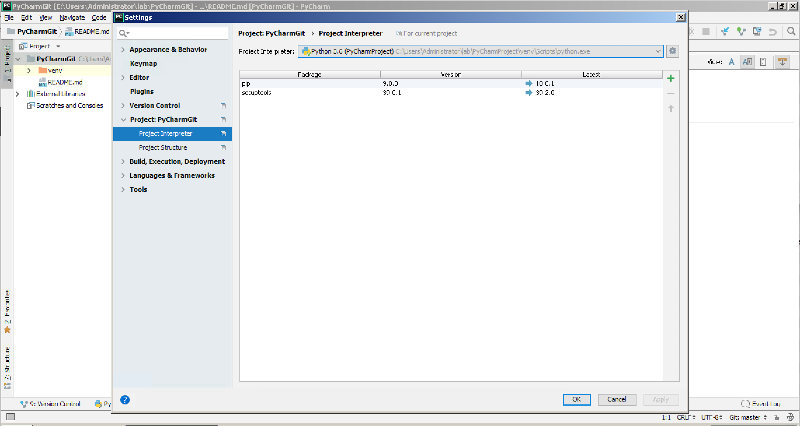
    
7. Let's re-create our "Hello World!" Python code.  Right click on `helloworld` and select `New` and click `Python
File`.
    
    Navigate to the `File` menu and click `New...` menu item.
    
    Click `Python File` in the pop up window.
    
    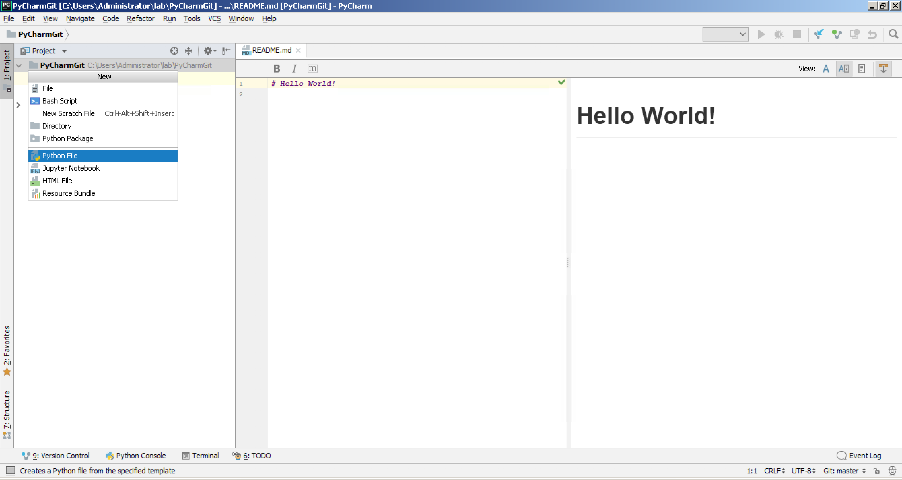
    
    In the box labeled `Name:`, type `helloworld.py`.  Click the drop down box labeled `Kind:` and select `Python 
    file`.
    
    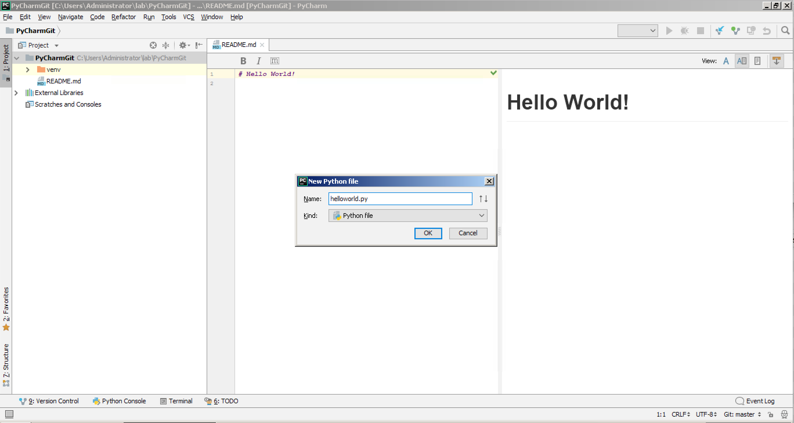
    
    Click the `OK` button.
    
    PyCharm knows that this project is under revision control with Git and prompts you to add the new 
    file to Git.  Click the `Yes` button.
        
    
    
    Now you have a new file named `helloworld.py` in the the root of your PyCharm `PyCharmGit` project directory.
    Go ahead and re-write Python code in the PyCharm editor:
    
    ```
    print("Hello World!")
    
    ```
    
    and save your changes by clicking the `File` menu and clicking `Save All`.
    
    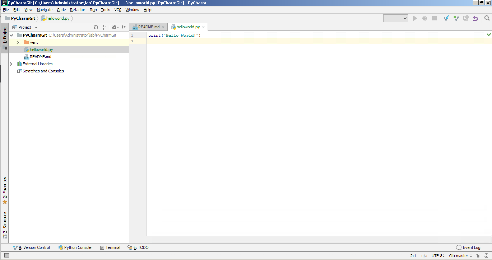

8. You will also notice new buttons in the navigation bar at the top of the application window and a new tool window bar
in the tool window tab at the bottom of the application window window: `Version Control`.  Click the `Version 
Control` tab.
    
    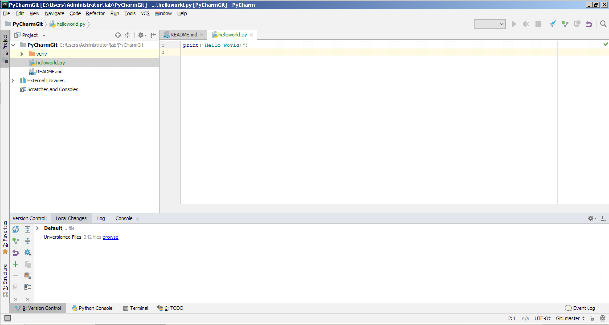
    
    First, you will get a status of all local changes.  Double click `Default` and you see your Python file 
    `helloworld.py`.
    
    Second, you will see `Unversioned Files` - too numerous to list, so click the `browse` button.
    
    Double click to expand the tree and you notice you have two directories each with files that are 
    unversioned.  These include the PyCharm project `.idea` directory and Python virtual environment `venv` 
    directory.
    
    Click to select the `.idea` directory.
    
    Click the fourth button from the left `Ignore`.
    
    Click the radio button labeled `Ignore all files under`.
    
    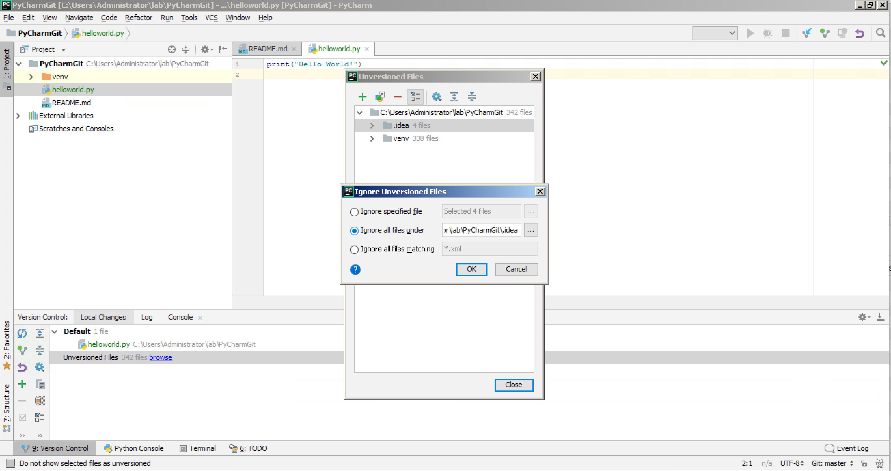
        
    Click the `OK` button.
    
    Click to select the `venv` directory.
    
    Click the fourth button from the left `Ignore`.
    
    Click the radio button labeled `Ignore all files under`.
    
    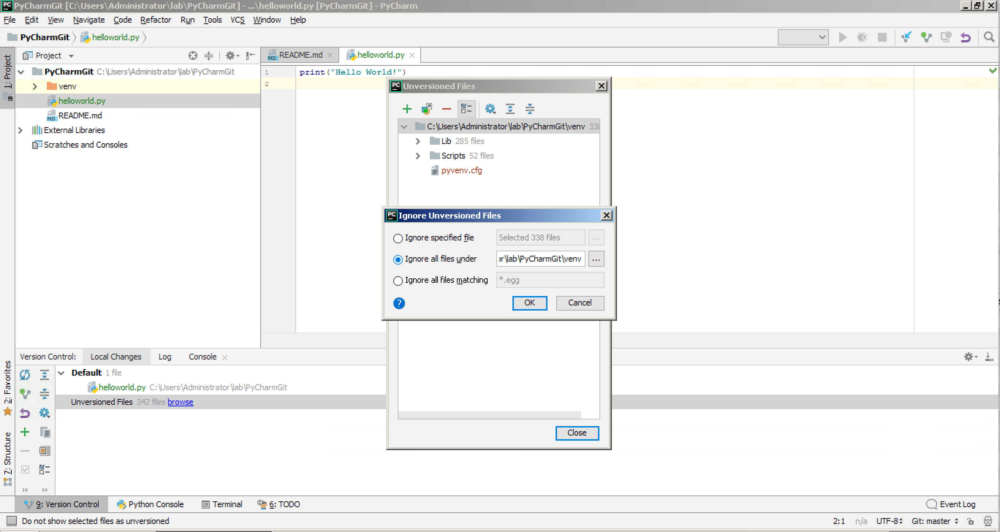
    
    Click the `Close` button.
    
    Now it is time to commit your changes.  Navigate to the `VCS` menu and click the `Commit...` menu item.
    
    In the box labeled `Commit Message`, add an entry such as `My first Git commit from PyCharm`.
    
    
    
    Click the `Commit` button.
    
    Now push your commited changes to the remote GitHub repository.  Navigate to the `VCS` menu, `Git` submenu, and 
    click the `Push...` menu item.
    
    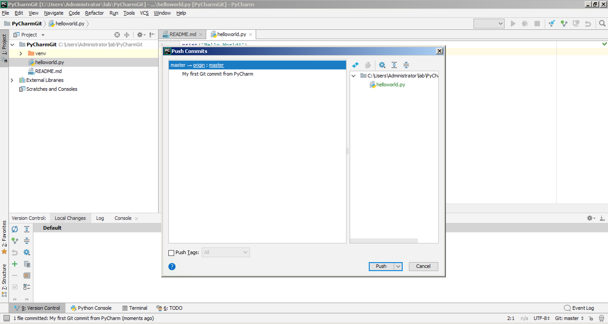
    
    Click the `Push` button.
        
    PyCharm will show you the status of your Git push and tell you when the action has been completed successfully.
    
    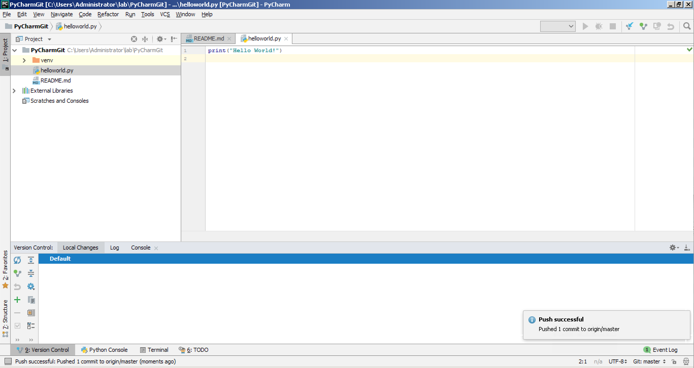
    
    Check your handiwork by opening a web browser and navigating to your Git repository in GitHub, for 
    example `https://github.com/curtissmith/clus18`, replacing `curtissmith` with your own GitHub username.
    
Congratulations, you've cloned a remote Git repository, staged a new Python file, committed those changes, and pushed
your changes into the remote Git repository without leaving the PyCharm application or having to go back and 
forth between PyCharm and the command line.  PyCharm makes managing the whole project easy, including with version 
control.

---

Navigation - [Next Page](LTRDEV-1100-Guide-02f.md)
